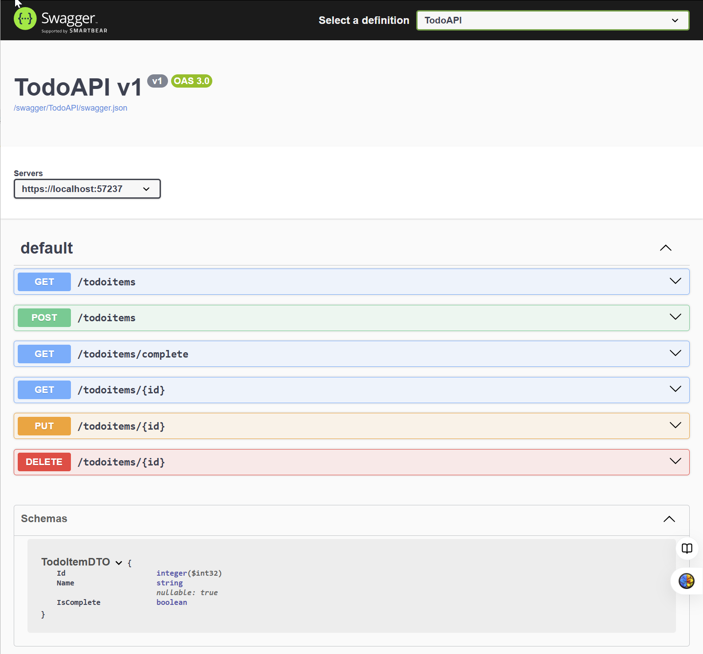

|               |                                     |                                        |
| ------------- | ----------------------------------- | -------------------------------------- |
| **Modul 321** | **Verteilte Systeme programmieren** |  |

- [1. ASP.NET Core Minimal APIs](#1-aspnet-core-minimal-apis)
  - [1.1. Sinn und Zweck](#11-sinn-und-zweck)
    - [1.1.1. Zusammenfassung](#111-zusammenfassung)
  - [1.2. Vorteile](#12-vorteile)
  - [1.3. Beispiel: Einfache API mit einer GET-Route](#13-beispiel-einfache-api-mit-einer-get-route)
  - [1.4. Beispiel: API mit Routen-Parametern](#14-beispiel-api-mit-routen-parametern)
  - [1.5. Beispiel: API mit Dependency Injection (DI)](#15-beispiel-api-mit-dependency-injection-di)
  - [1.6. Beispiel: API mit Datenbank (Entity Framework Core)](#16-beispiel-api-mit-datenbank-entity-framework-core)
- [2. DTO (Data Transfer Objects) Klassen](#2-dto-data-transfer-objects-klassen)
  - [2.1. Beispiel](#21-beispiel)
  - [2.2. Fazit](#22-fazit)
- [3. Aufgaben](#3-aufgaben)
  - [3.1. Erstellen einer Web-API mit minimaler API, ASP.NET Core und .NET](#31-erstellen-einer-web-api-mit-minimaler-api-aspnet-core-und-net)
  - [3.2. Tutorial: Create a minimal API with ASP.NET Core (ToDo)](#32-tutorial-create-a-minimal-api-with-aspnet-core-todo)
  - [3.3. Tutorial: Create a minimal API with ASP.NET Core with DTO (ToDo)](#33-tutorial-create-a-minimal-api-with-aspnet-core-with-dto-todo)

---

</br>

# 1. ASP.NET Core Minimal APIs

- ASP.NET Core **Minimal APIs** sind eine **schlankere und einfachere Möglichkeit**, Web-APIs in .NET zu erstellen.
- Sie wurden mit .NET 6 eingeführt und sind besonders nützlich **für kleine APIs**, **Microservices** oder Anwendungen, bei denen **eine vollständige Controller-basierte Architektur** nicht erforderlich ist.

## 1.1. Sinn und Zweck

- ASP.NET Core **Minimal APIs** sind eine hervorragende Wahl für kleine, schnelle APIs mit **geringem Overhead**.
- Sie bieten eine einfache Möglichkeit, Web-APIs zu entwickeln, sind aber **nicht ideal für komplexe, gross angelegte Anwendungen**. Wenn du eine API für ein grösseres Projekt erstellst, könnte die traditionelle **Controller-basierte** Architektur besser geeignet sein.

### 1.1.1. Zusammenfassung

- **Reduzierung** des Overheads bei der API-Entwicklung.
- **Vereinfachung** der Code-Struktur durch weniger Boilerplate-Code.
- **Schnelleres** Prototyping von APIs.
- Optimiert für **Performance** und geringe Latenz.
- Ideal für serverlose Architekturen, **Container-basierte Anwendungen** und Microservices.

## 1.2. Vorteile

- **Weniger Boilerplate-Code**: Kein Controller-Verzeichnis, keine Startup.cs, sondern eine einzige Program.cs-Datei.
- **Schnellere Entwicklung**: APIs können mit wenigen Zeilen Code erstellt werden.
- **Bessere Performance**: Reduziert Overhead, da keine Middleware oder Controller-Klassen erforderlich sind.
- **Einfachheit**: Besonders gut geeignet für kleine APIs oder Prototypen.
- **Verbesserte Übersichtlichkeit**: Code ist kürzer und direkter.

[Minimal APIs quick reference](https://learn.microsoft.com/en-us/aspnet/core/fundamentals/minimal-apis?view=aspnetcore-9.0)

---

## 1.3. Beispiel: Einfache API mit einer GET-Route

```c#
var builder = WebApplication.CreateBuilder(args);
var app = builder.Build();

app.MapGet("/", () => "Hello, World!");

app.Run();
```

## 1.4. Beispiel: API mit Routen-Parametern

```c#
app.MapGet("/hello/{name}", (string name) => $"Hello, {name}!");
```

## 1.5. Beispiel: API mit Dependency Injection (DI)

```c#
var builder = WebApplication.CreateBuilder(args);
builder.Services.AddSingleton<MyService>(); 

var app = builder.Build();

app.MapGet("/data", (MyService service) => service.GetData());

app.Run();

public class MyService
{
    public string GetData() => "Hier sind die Daten!";
}
```

## 1.6. Beispiel: API mit Datenbank (Entity Framework Core)

```c#
var builder = WebApplication.CreateBuilder(args);
builder.Services.AddDbContext<AppDbContext>(options => 
    options.UseInMemoryDatabase("TestDb"));

var app = builder.Build();

app.MapPost("/products", async (AppDbContext db, Product product) =>
{
    db.Products.Add(product);
    await db.SaveChangesAsync();
    return Results.Created($"/products/{product.Id}", product);
});

app.MapGet("/products", async (AppDbContext db) => 
    await db.Products.ToListAsync());

app.Run();

public class AppDbContext : DbContext
{
    public AppDbContext(DbContextOptions<AppDbContext> options) : base(options) { }
    public DbSet<Product> Products => Set<Product>();
}

public class Product
{
    public int Id { get; set; }
    public string Name { get; set; }
    public decimal Price { get; set; }
}

```

# 2. DTO (Data Transfer Objects) Klassen

- In einem WebAPI-Projekt werden **DTO-Klassen (Data Transfer Objects)** verwendet, um Daten zwischen der Client- und der Server-Schicht zu übertragen, insbesondere bei der Kommunikation über ein Netzwerk.
- Sie spielen eine **zentrale Rolle in der Architektur von Web-APIs,** da sie helfen, die Datenstruktur zu optimieren und die Kommunikation zwischen verschiedenen Systemkomponenten zu vereinfachen.
- In vielen Fällen ist die Datenstruktur der zugrunde liegenden **Domain** oder **Datenbank** nicht direkt für die **Kommunikation** über die API geeignet.
- Durch die Verwendung von **DTOs** können die internen Entitäten und die externen Datenformate voneinander **entkoppelt** werden.
- Dadurch können Änderungen in der internen Datenstruktur vorgenommen werden, **ohne** dass dies sofort Auswirkungen auf die API und den Client hat.

## 2.1. Beispiel

```c#
public class UserDTO
{
    public string Name { get; set; }
    public string Email { get; set; }
}

public IActionResult GetUser(int id)
{
    var user = _userService.GetUserById(id); // Holt den User aus der DB
    var userDTO = new UserDTO
    {
        Name = user.Name,
        Email = user.Email
    };
    return Ok(userDTO); // Gibt nur Name und Email zurück
}
```

## 2.2. Fazit

**DTO's** ermöglichen es, Datenstrukturen anzupassen, Daten nur **nach Bedarf zu übertragen** und den Code sauber und wartbar zu halten, indem die Interaktion zwischen der Client- und Server-Schicht **vereinfacht** wird.

</br>

# 3. Aufgaben

## 3.1. Erstellen einer Web-API mit minimaler API, ASP.NET Core und .NET

| **Vorgabe**         | **Beschreibung**                                                                                                 |
| :------------------ | :--------------------------------------------------------------------------------------------------------------- |
| **Lernziele**       | Unterscheiden Sie zwischen der Verwendung einer Controller basierten API und der Verwendung einer minimalen API. |
|                     | Erstellen von Routen zum Verarbeiten von Lese- und Schreibvorgängen                                              |
|                     | Verwenden Sie Features aus .NET, um Ihren Code so kurz wie möglich zu gestalten.                                 |
| **Sozialform**      | Einzelarbeit                                                                                                     |
| **Auftrag**         | siehe unten                                                                                                      |
| **Hilfsmittel**     | [Learn](https://learn.microsoft.com/de-ch/training/modules/build-web-api-minimal-api/)                           |
| **Zeitbedarf**      | 25min                                                                                                            |
| **Lösungselemente** | Lauffähiges .NET Projekt                                                                                         |

**Auftrag:**

Arbeite das [Tutorial](https://learn.microsoft.com/de-ch/training/modules/build-web-api-minimal-api/) durch und fasse die wesentlichen Unterschiede zur controllerbasierten API Implementierung zusammen.

---

## 3.2. Tutorial: Create a minimal API with ASP.NET Core (ToDo)

| **Vorgabe**         | **Beschreibung**                                                                                                                                               |
| :------------------ | :------------------------------------------------------------------------------------------------------------------------------------------------------------- |
| **Lernziele**       | Unterscheiden Sie zwischen der Verwendung einer Controller basierten API und der Verwendung einer minimalen API.                                               |
|                     | Erstellen von Routen zum Verarbeiten von Lese- und Schreibvorgängen                                                                                            |
|                     | Verwenden Sie Features aus .NET, um Ihren Code so kurz wie möglich zu gestalten.                                                                               |
| **Sozialform**      | Einzelarbeit                                                                                                                                                   |
| **Auftrag**         | siehe unten                                                                                                                                                    |
| **Hilfsmittel**     | [Tutorial: Create a minimal API with ASP.NET Core](https://learn.microsoft.com/en-us/aspnet/core/tutorials/min-web-api?view=aspnetcore-9.0&tabs=visual-studio) |
| **Zeitbedarf**      | 35min                                                                                                                                                          |
| **Lösungselemente** | Lauffähiges .NET Projekt                                                                                                                                       |

**Auftrag:**

Arbeite das [Tutorial](https://learn.microsoft.com/en-us/aspnet/core/tutorials/min-web-api?view=aspnetcore-9.0&tabs=visual-studio)
durch und teste alle **Endpoints** mit .http Datei oder Postman.

---

## 3.3. Tutorial: Create a minimal API with ASP.NET Core with DTO (ToDo)

| **Vorgabe**         | **Beschreibung**                                                                                                                                               |
| :------------------ | :------------------------------------------------------------------------------------------------------------------------------------------------------------- |
| **Lernziele**       | Unterscheiden Sie zwischen der Verwendung einer Controller basierten API und der Verwendung einer minimalen API.                                               |
|                     | Erstellen von Routen zum Verarbeiten von Lese- und Schreibvorgängen                                                                                            |
|                     | Verwenden Sie Features aus .NET, um Ihren Code so kurz wie möglich zu gestalten.                                                                               |
| **Sozialform**      | Einzelarbeit                                                                                                                                                   |
| **Auftrag**         | siehe unten                                                                                                                                                    |
| **Hilfsmittel**     | [Tutorial: Create a minimal API with ASP.NET Core](https://learn.microsoft.com/en-us/aspnet/core/tutorials/min-web-api?view=aspnetcore-9.0&tabs=visual-studio) |
| **Zeitbedarf**      | 35min                                                                                                                                                          |
| **Lösungselemente** | Lauffähiges .NET Projekt                                                                                                                                       |

**Auftrag:**

Erweitere die Aufgabe 3.2, sodass an stelle der Domain-Klasse die DTO Klasse (TodoItemDTO) für den Datenaustausch zwischen dem Client u. Server verwendet wird.


