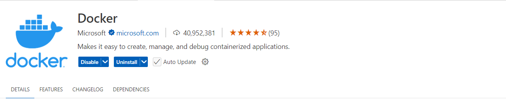
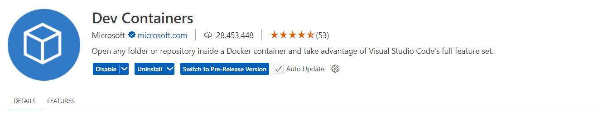
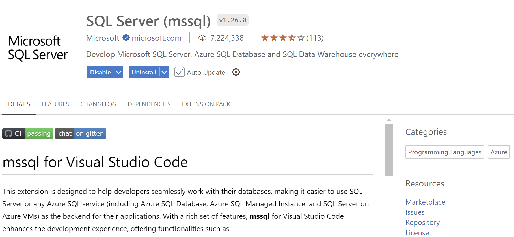
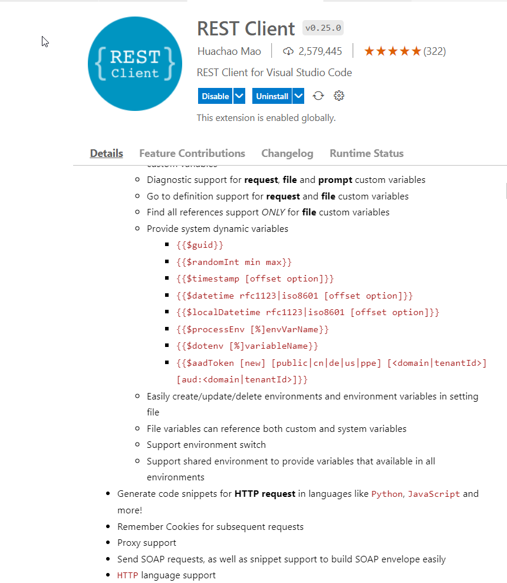
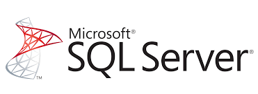
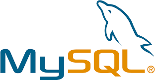
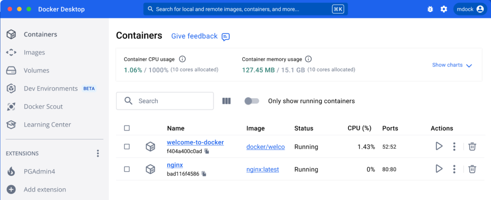

|               |                                     |                                        |
| ------------- | ----------------------------------- | -------------------------------------- |
| **Modul 321** | **Verteilte Systeme programmieren** |  |

- [1. Voraussetzungen / Softwareinstallationen](#1-voraussetzungen--softwareinstallationen)
  - [1.1. Visual Studio](#11-visual-studio)
  - [1.2. Visual Studio Code](#12-visual-studio-code)
    - [1.2.1. Extension - Docker](#121-extension---docker)
    - [1.2.2. Extension - Dev Container](#122-extension---dev-container)
    - [1.2.3. Extension - MS-SQL](#123-extension---ms-sql)
    - [1.2.4. Extension - REST-Client](#124-extension---rest-client)
  - [1.3. SQL-Datenbanken](#13-sql-datenbanken)
  - [1.4. Docker](#14-docker)
  - [1.5. Postman](#15-postman)
- [2. Aufgabe - Installation u. Softwarevoraussetzungen / Tools](#2-aufgabe---installation-u-softwarevoraussetzungen--tools)

 

# 1. Voraussetzungen / Softwareinstallationen

## 1.1. Visual Studio

[Download Visual Studio](https://visualstudio.microsoft.com/de/vs/community/)

## 1.2. Visual Studio Code

[Download Visual Studio Code](https://code.visualstudio.com/)

### 1.2.1. Extension - Docker

### 1.2.2. Extension - Dev Container

### 1.2.3. Extension - MS-SQL

### 1.2.4. Extension - REST-Client

---

## 1.3. SQL-Datenbanken

Es muss nur eine Datenbanksoftware installiert werden.
Es wird empfohlen SQL-Server zu verwenden.

Alternativ kann auch MySQL verwendet werden.

---

## 1.4. Docker

[Docker Desktop](https://www.docker.com/products/docker-desktop/)

---

 

## 1.5. Postman

- [Postman](https://www.postman.com/downloads/) ist eines der beliebtesten Werkzeuge zum Testen von APIs (Application Programming Interfaces).
- APIs sind Schnittstellen zwischen Programmen, über die die Anwendungen miteinander kommunizieren.

- Haupteinsatzgebiet ist das Testen von REST APIs auf HTTP-Basis.
- Der grundlegende Aufbau fokussiert sich dabei auf das Verarbeiten und Validieren von Requests und deren Responses.
- HTTP-Requests lassen sich in Postman mit zugehörigen Parametern über den visuellen Request-Builder spezifizieren und absenden.
- Die Responses können direkt angesehen und ausgewertet werden, sei es grafisch oder über die interne Programmierschnittstelle von Postman mittels JavaScript.

[Download Postman](https://www.postman.com/downloads/)

---

 

# 2. Aufgabe - Installation u. Softwarevoraussetzungen / Tools

| **Vorgabe**             | **Beschreibung**                     |
| :---------------------- | :----------------------------------- |
| **Lernziele**           | Softwarevoraussetzungen sind erfüllt |
| **Sozialform**          | Einzelarbeit                         |
| **Auftrag**             | Softwareinstallationen auf Laptop    |
| **Hilfsmittel**         | siehe Download links                 |
| **Erwartete Resultate** |                                      |
| **Zeitbedarf**          | 40 min                               |
| **Lösungselemente**     | Ausführbare SW Anwendungen           |

**Auftrag:**

- Installiere alle erforderlichen Softwarekomponenten auf deinem Rechner.
- Teste soweit möglich, dass alle Komponenten ohne Fehler ausgeführt werden und funktionstauglich sind.
