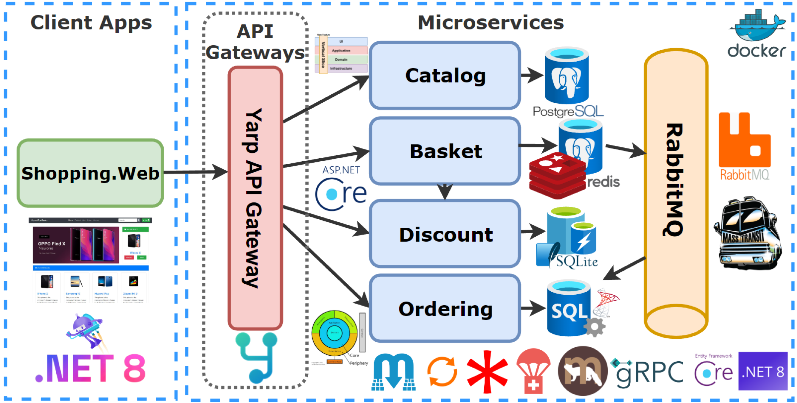
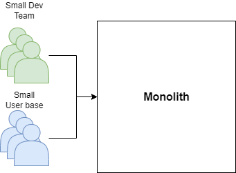
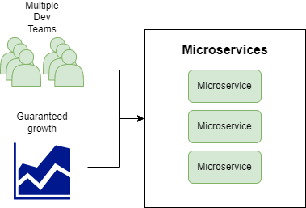
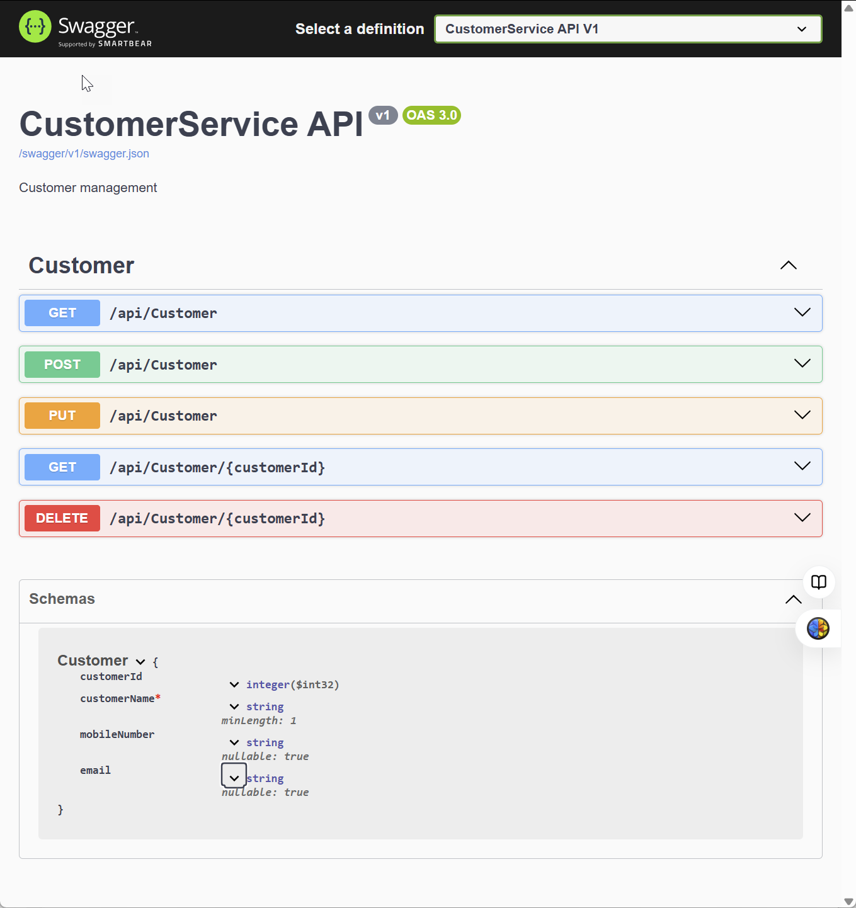
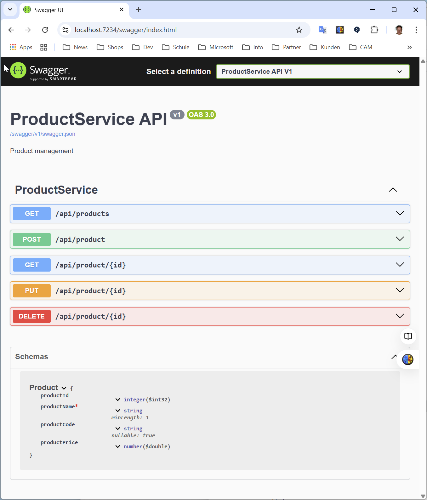

|               |                                     |                                        |
| ------------- | ----------------------------------- | -------------------------------------- |
| **Modul 321** | **Verteilte Systeme programmieren** |  |

- [1. Microservices](#1-microservices)
  - [1.1. Einführung](#11-einführung)
  - [1.2. Grundprinzipien von Microservices](#12-grundprinzipien-von-microservices)
  - [1.3. Vorteile von Microservices](#13-vorteile-von-microservices)
  - [1.4. Herausforderungen von Microservices](#14-herausforderungen-von-microservices)
  - [1.5. Monolith vs. Microservices](#15-monolith-vs-microservices)
  - [1.6. Zusammenfassung](#16-zusammenfassung)
- [2. Aufgaben](#2-aufgaben)
  - [2.1. Build your first microservice with .NET (Tutorial)](#21-build-your-first-microservice-with-net-tutorial)
  - [2.2. ecommerce Microservices erstellen](#22-ecommerce-microservices-erstellen)

---

 

# 1. Microservices

## 1.1. Einführung

- **Microservices** sind eine Architektur für Softwareentwicklung, bei der Anwendungen in eine Sammlung kleiner, autonomer Dienste zerlegt werden.
- Jeder Dienst ist auf eine **spezifische Geschäftsanforderung spezialisiert** und arbeitet unabhängig von anderen Diensten.
- Diese Architektur ist besonders bei der Entwicklung **moderner, skalierbarer und flexibler Anwendungen** beliebt.

## 1.2. Grundprinzipien von Microservices

- **Autonomie:** Jeder Microservice ist eine eigenständige Einheit, die unabhängig entwickelt, bereitgestellt und skaliert werden kann.
- **Single Responsibility Principle (SRP):** Ein Microservice konzentriert sich auf eine klar definierte Aufgabe oder Geschäftsanforderung.
- **Lose Kopplung:** Dienste sind so konzipiert, dass Änderungen an einem Dienst die anderen minimal beeinflussen.
- **Technologische Vielfalt:** Jeder Dienst kann in einer für seine Anforderungen geeigneten Technologie entwickelt werden.
- **Leichte Kommunikation:** Microservices kommunizieren über standardisierte Protokolle, z. B. HTTP/REST, gRPC oder Messaging-Systeme.
- **Skalierbarkeit:** Jeder Microservice kann unabhängig skaliert werden, was die Ressourcennutzung optimiert.
- **Fehlertoleranz:** Fehler in einem Dienst sollten nicht die gesamte Anwendung beeinträchtigen.

## 1.3. Vorteile von Microservices

- **Skalierbarkeit:** Dienste können **unabhängig** voneinander skaliert werden.
- **Wartbarkeit:** Kleine Codebasen sind **einfacher** zu warten und zu testen.
- **Flexibilität:** Unterschiedliche **Technologien** und Datenbanken können je nach Bedarf genutzt werden.
- **Schnellere Entwicklungszyklen:** Teams können unabhängig voneinander an verschiedenen Diensten arbeiten.

## 1.4. Herausforderungen von Microservices

- **Komplexität**
  - Die Verwaltung vieler kleiner Dienste kann schwierig sein.
- **Kommunikation**
  - Die Interaktion zwischen Diensten erfordert robuste und effiziente Protokolle.
- **Deployment**
  - Der Aufbau einer CI/CD-Pipeline für viele Dienste kann komplex sein.
- **Datenmanagement**
  - Das Teilen von Daten und die Konsistenz zwischen Diensten können herausfordernd sein.

## 1.5. Monolith vs. Microservices

- **Monolith** und **Microservices** sind zwei verschiedene Ansätze für den Aufbau von Softwareanwendungen, insbesondere in Bezug auf deren Architektur und Struktur.
- **Monolithische Architekturen** sind einfacher für **kleinere, weniger komplexe Anwendungen**, während **Microservices** besonders bei grossen, skalierbaren und wartungsintensiven Systemen von Vorteil sind.
- Der Übergang von **Monolithen** zu **Microservices** kann jedoch herausfordernd sein und erfordert eine sorgfältige Planung.

Eine **monolithische Architektur** ist eine Softwarelösung, bei der **alle Komponenten der Anwendung in einem einzigen Codeblock** integriert sind. Alle **Funktionen** wie Datenbankzugriff, Benutzeroberfläche und Logik sind **eng miteinander verbunden**.

- **Microservices** ist ein Architekturstil, bei dem die Anwendung in eine Sammlung **kleiner, unabhängiger Services** unterteilt wird, die jeweils eine **spezifische Funktion** ausführen.
- Diese Services kommunizieren über **APIs** und können **unabhängig** voneinander entwickelt, getestet, deployed und skaliert werden.

## 1.6. Zusammenfassung

- **Microservices** bieten eine leistungsstarke Möglichkeit, **flexible** und **skalierbare** **Anwendungen** zu erstellen. 
- Sie bringen jedoch auch Herausforderungen mit sich, die sorgfältige Planung und robuste Lösungen erfordern. 
- Mit Technologien wie ASP.NET Core und Tools wie **Docker** oder **Kubernetes** können **Microservices** effizient umgesetzt und verwaltet werden

 

# 2. Aufgaben

 

## 2.1. Build your first microservice with .NET (Tutorial)

| **Vorgabe**         | **Beschreibung**                                                                     |
| :------------------ | :----------------------------------------------------------------------------------- |
| **Lernziele**       | Kann ein .NET Microservice in Visual Studio erstellen                                |
|                     | Kann ein Projekt für Docker veröffentlichen (publish)                                |
|                     | Kann den Service in Docker starten und testen                                        |
| **Sozialform**      | Einzelarbeit                                                                         |
| **Auftrag**         | siehe unten                                                                          |
| **Hilfsmittel**     | [MS-Learn](https://learn.microsoft.com/en-us/training/modules/dotnet-microservices/) |
| **Zeitbedarf**      | 30min                                                                                |
| **Lösungselemente** | Lauffähige Anwendung auf dem Laptop                                                  |

In diesem Tutorial lernen Sie, wie Sie Ihren ersten Microservice mit Hilfe von .NET entwickeln und den Service in Docker ausführen.

- [Build your first microservice with .NET](https://learn.microsoft.com/en-us/training/modules/dotnet-microservices/)

Lösen Sie die beiden Übungen und fassen Sie die wichtigsten Befehle kurz zusammen:

- Exercise - Build a container image for your .NET microservice
- Exercise - Create a Docker Compose file for orchestration

---

## 2.2. ecommerce Microservices erstellen

| **Vorgabe**         | **Beschreibung**                                                                     |
| :------------------ | :----------------------------------------------------------------------------------- |
| **Lernziele**       | Kann ein .NET Microservice in Visual Studio erstellen                                |
|                     | Kann ein Projekt für Docker veröffentlichen (publish)                                |
|                     | Kann den Service in Docker starten und testen                                        |
| **Sozialform**      | Einzelarbeit                                                                         |
| **Auftrag**         | siehe unten                                                                          |
| **Hilfsmittel**     | [MS-Learn](https://learn.microsoft.com/en-us/training/modules/dotnet-microservices/) |
| **Zeitbedarf**      | 120min                                                                               |
| **Lösungselemente** | Lauffähige Anwendung auf dem Laptop                                                  |

Erstelle in Visual Studio folgende Projektumgebung:

- Solution: ecommerce
- [Projektstruktur](./x_gitres/task-ecommerce-project-structure.png)

**WebAPI Project:**

- Name: **CustomerService**
- Datenbank: **Sqlite**
- 

**WebAPI Project:**

- Name: **ProductService**
- Datenbank: **SQL-Server**
- 
