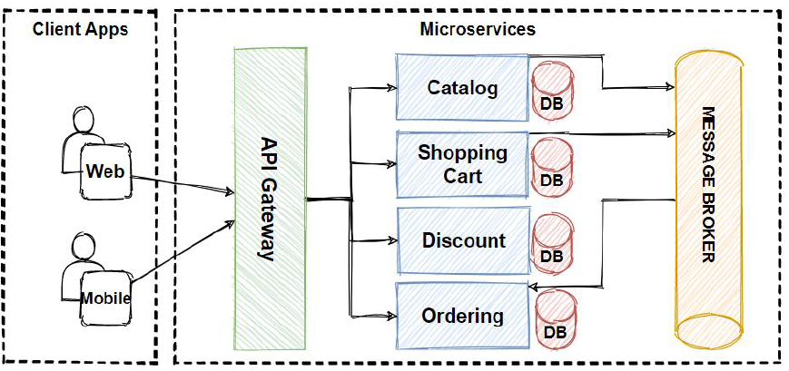
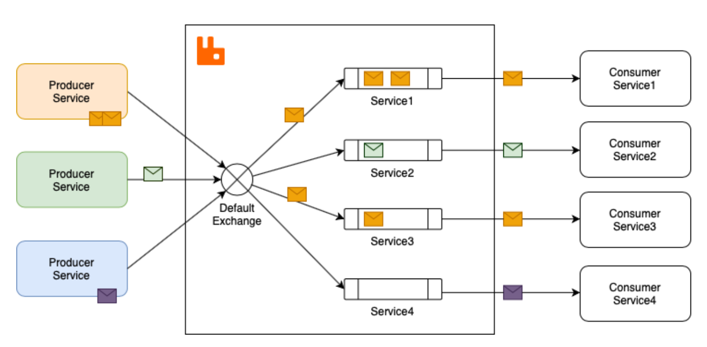
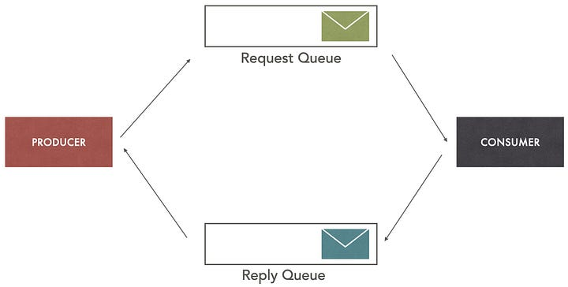
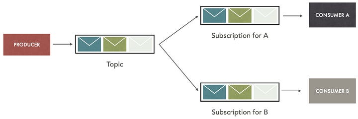
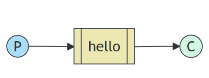
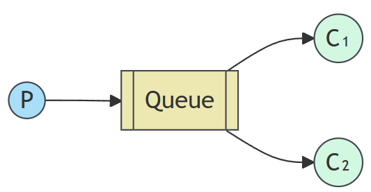
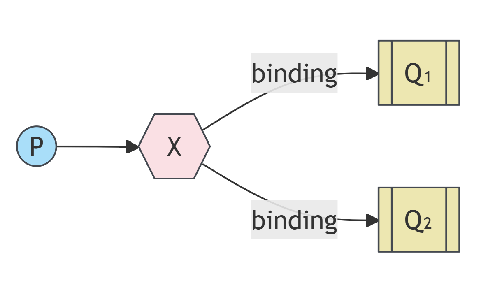
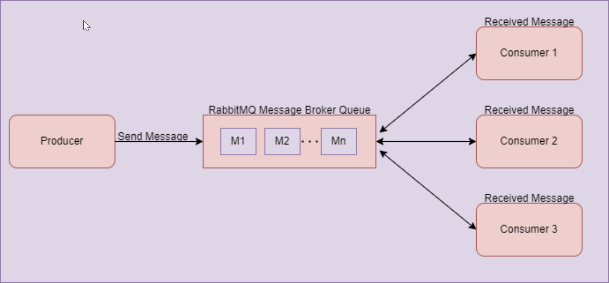
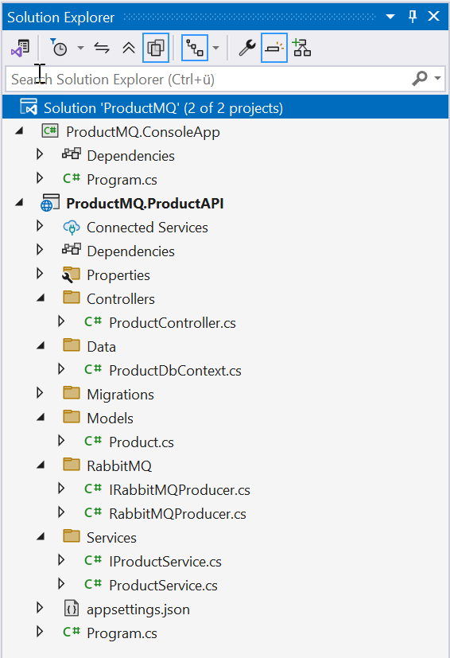
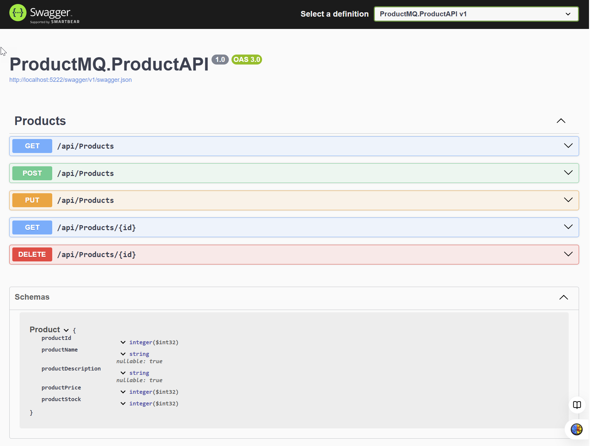

|               |                                     |                                        |
| ------------- | ----------------------------------- | -------------------------------------- |
| **Modul 321** | **Verteilte Systeme programmieren** |  |

- [1. Message Broker in Verteilten Systemen](#1-message-broker-in-verteilten-systemen)
  - [1.1. Einführung](#11-einführung)
  - [1.2. Was ist ein Message Broker?](#12-was-ist-ein-message-broker)
  - [1.3. Architektur eines Message Brokers](#13-architektur-eines-message-brokers)
  - [1.4. Einsatzszenarien](#14-einsatzszenarien)
  - [1.5. Beispiele für Message Broker](#15-beispiele-für-message-broker)
  - [1.6. Anwendungsfälle in Verteilten Systemen](#16-anwendungsfälle-in-verteilten-systemen)
    - [1.6.1. Microservices-Kommunikation](#161-microservices-kommunikation)
    - [1.6.2. Event-Driven Architektur (EDA)](#162-event-driven-architektur-eda)
    - [1.6.3. Task-Queue-Verarbeitung](#163-task-queue-verarbeitung)
    - [1.6.4. Datenreplikation](#164-datenreplikation)
    - [1.6.5. Skalierung und Lastverteilung (Loadbalancing)](#165-skalierung-und-lastverteilung-loadbalancing)
  - [1.7. Beispiel mit RabbitMQ in .NET](#17-beispiel-mit-rabbitmq-in-net)
  - [1.8. Arten von Exchange-Typen](#18-arten-von-exchange-typen)
    - [1.8.1. Direct Exchange](#181-direct-exchange)
    - [1.8.2. Request/Replay](#182-requestreplay)
    - [1.8.3. Publish/Subscribe (Fanout Exchange)](#183-publishsubscribe-fanout-exchange)
  - [1.9. Producer](#19-producer)
  - [1.10. Consumer](#110-consumer)
  - [1.11. Fazit](#111-fazit)
- [2. Aufgaben](#2-aufgaben)
  - [2.1. Installing RabbitMQ](#21-installing-rabbitmq)
  - [2.2. RabbitMQ Tutorial - "Hello World" (Tutorial)](#22-rabbitmq-tutorial---hello-world-tutorial)
  - [2.3. RabbitMQ Tutorial - "Work Queues" (Tutorial)](#23-rabbitmq-tutorial---work-queues-tutorial)
  - [2.4. RabbitMQ Tutorial - "Publish/Subscribe" (Tutorial)](#24-rabbitmq-tutorial---publishsubscribe-tutorial)
  - [2.5. RabbitMQ Kommunikation (Praxisprojekt)](#25-rabbitmq-kommunikation-praxisprojekt)

</br>

# 1. Message Broker in Verteilten Systemen

## 1.1. Einführung

In **verteilten Systemen** ist es oft erforderlich, dass verschiedene Dienste oder Anwendungen miteinander kommunizieren.
Dabei stossen Entwickler jedoch auf Probleme wie **Skalierbarkeit, Fehlertoleranz und lose Kopplung**.
Ein **Message Broker** dient als **Middleware**, um diese Herausforderungen zu bewältigen, indem er die Kommunikation zwischen verschiedenen Komponenten eines Systems erleichtert.



## 1.2. Was ist ein Message Broker?

Ein **Message Broker** ist eine Software, die Nachrichten von einem Sender (Producer) empfängt und an einen oder mehrere Empfänger (Consumer) weiterleitet.
Er fungiert als **Vermittler** zwischen den Komponenten eines **verteilten Systems** und bietet folgende Vorteile:



**Entkopplung:** Sender und Empfänger müssen sich nicht direkt kennen.

**Zuverlässigkeit:** Nachrichten werden zwischengespeichert und können auch bei Ausfällen der Empfänger später zugestellt werden.

**Lastverteilung:** Durch paralleles Verarbeiten von Nachrichten wird die Last effizient verteilt.

**Unterstützung von Mustern:** Ermöglicht Pub/Sub- oder Punkt-zu-Punkt-Kommunikation.

Beispiele für Message Broker sind RabbitMQ, Apache Kafka, ActiveMQ und Azure Service Bus (siehe [Wiki](https://en.wikipedia.org/wiki/Message_broker))

## 1.3. Architektur eines Message Brokers

Ein typischer Message Broker arbeitet mit den folgenden Konzepten:

- **Queues:** Nachrichten werden in Warteschlangen abgelegt und sequenziell verarbeitet.
- **Topics:** Ermöglicht Publish/Subscribe-Muster, bei dem mehrere Konsumenten Nachrichten empfangen können.
- **Exchanges:** Leiten Nachrichten basierend auf Routing-Regeln an die passenden Queues weiter.
- **Bindings:** Verknüpfen Exchanges mit Queues.

## 1.4. Einsatzszenarien

- **Mikroservice-Architekturen:** Zur Synchronisation und Kommunikation zwischen Services.
- **Ereignisgesteuerte Systeme:** Für das Veröffentlichen und Konsumieren von Ereignissen.
- **Datenintegration:** Verbindung zwischen verschiedenen Datenquellen und Anwendungen.

## 1.5. Beispiele für Message Broker

- **RabbitMQ**: Ein weit verbreiteter Broker mit Unterstützung für das Advanced Message Queuing Protocol (AMQP). Ideal für asynchrone Aufgabenverarbeitung.
- **Apache Kafka**: Ein verteilter Event-Streaming-Plattform-Broker, optimiert für hohe Durchsatzraten und Langlebigkeit.
- **Redis Streams**: Ein schnelles In-Memory-Broker-System mit Streaming-Funktionalität.
- **Amazon SQS**: Ein vollständig verwalteter Message Queue Service in der AWS-Cloud.

## 1.6. Anwendungsfälle in Verteilten Systemen

### 1.6.1. Microservices-Kommunikation

In Microservices-Architekturen werden **Message Broker** eingesetzt, um Dienste voneinander zu entkoppeln.
Statt synchroner API-Aufrufe können Dienste Nachrichten über einen Broker senden und empfangen.

**Beispiel:**

- Ein Bestellsystem sendet eine Nachricht an einen Broker, sobald eine Bestellung aufgegeben wird.
- Ein Zahlungsservice empfängt die Nachricht, prüft die Zahlung und sendet eine Bestätigung an den Broker.
- Andere Dienste wie ein Versanddienst oder ein Benachrichtigungssystem abonnieren das gleiche Ereignis.

### 1.6.2. Event-Driven Architektur (EDA)

EDA basiert auf Ereignissen, die von einem System erzeugt und von einem anderen konsumiert werden.
**Message Broker** ermöglichen es, diese Ereignisse zu verteilen.

**Beispiel:**

- In einer **IoT-Umgebung** sendet ein Temperatursensor regelmässig Daten an einen Broker.
- Verschiedene Anwendungen (z. B. zur Analyse oder Alarmierung) abonnieren die Temperaturdaten und reagieren darauf.

### 1.6.3. Task-Queue-Verarbeitung

Message Broker werden häufig für Aufgaben genutzt, die in Hintergrundprozessen verarbeitet werden müssen.

**Beispiel:**

- Ein User lädt ein Bild hoch.
- Der Broker stellt die Nachricht in eine Warteschlange, die von einem Worker-Service verarbeitet wird, um das Bild zu komprimieren und in einem CDN zu speichern.

### 1.6.4. Datenreplikation

Message Broker wie Apache Kafka werden genutzt, um Änderungen in einer Datenbank zu erfassen und an andere Systeme weiterzuleiten.

**Beispiel:**

- Änderungen in der primären Datenbank werden als Ereignisse erfasst.
- Diese Ereignisse werden an andere Systeme wie Data Warehouses oder Cache-Systeme verteilt.

### 1.6.5. Skalierung und Lastverteilung (Loadbalancing)

**Message Broker** können verwendet werden, um Lasten dynamisch auf mehrere Worker zu verteilen (Loadbalancing).

## 1.7. Beispiel mit RabbitMQ in .NET

Nachfolgend ein Codebeispiel, das zeigt, wie ein **Producer** und ein **Consumer** mit RabbitMQ implementiert werden können.
[Einführung zu RabbitMQ](https://www.youtube.com/watch?v=fLWD8rJFAVk)

## 1.8. Arten von Exchange-Typen

In **RabbitMQ** gibt es mehrere **Exchange-Typen**, die unterschiedliche Mechanismen zur Nachrichtenverteilung an die verbundenen Queues bieten.

### 1.8.1. Direct Exchange


---

### 1.8.2. Request/Replay



---

### 1.8.3. Publish/Subscribe (Fanout Exchange)



## 1.9. Producer

- Erstellt eine Verbindung zum RabbitMQ-Server.
- Deklariert eine Queue mit dem Namen hello.
- Sendet eine Nachricht an die Queue.

```c#
using System;
using System.Text;
using RabbitMQ.Client;

class Producer
{
    public static void Main()
    {
        var factory = new ConnectionFactory() { HostName = "localhost" };
        using (var connection = factory.CreateConnection())
        using (var channel = connection.CreateModel())
        {
            channel.QueueDeclare(queue: "hello",
                                 durable: false,
                                 exclusive: false,
                                 autoDelete: false,
                                 arguments: null);

            string message = "Hello, RabbitMQ!";
            var body = Encoding.UTF8.GetBytes(message);

            channel.BasicPublish(exchange: "",
                                 routingKey: "hello",
                                 basicProperties: null,
                                 body: body);

            Console.WriteLine(" [x] Sent {0}", message);
        }
    }
}
```

## 1.10. Consumer

- Erstellt ebenfalls eine Verbindung zum Server.
- Deklariert die gleiche Queue, um Nachrichten von ihr zu lesen.
- Registriert ein Ereignis, das ausgeführt wird, wenn eine Nachricht empfangen wird.

```c#
using System;
using System.Text;
using RabbitMQ.Client;
using RabbitMQ.Client.Events;

class Consumer
{
    public static void Main()
    {
        var factory = new ConnectionFactory() { HostName = "localhost" };
        using (var connection = factory.CreateConnection())
        using (var channel = connection.CreateModel())
        {
            channel.QueueDeclare(queue: "hello",
                                 durable: false,
                                 exclusive: false,
                                 autoDelete: false,
                                 arguments: null);

            var consumer = new EventingBasicConsumer(channel);
            consumer.Received += (model, ea) =>
            {
                var body = ea.Body.ToArray();
                var message = Encoding.UTF8.GetString(body);
                Console.WriteLine(" [x] Received {0}", message);
            };

            channel.BasicConsume(queue: "hello",
                                 autoAck: true,
                                 consumer: consumer);

            Console.WriteLine(" Press [enter] to exit.");
            Console.ReadLine();
        }
    }
}
```

## 1.11. Fazit

**Message Broker** sind essentielle Komponenten in verteilten Systemen, um Skalierbarkeit, Zuverlässigkeit und lose Kopplung sicherzustellen.
Mit Tools wie **RabbitMQ** und Programmiersprachen wie C# lassen sich solche Systeme einfach und effizient implementieren.

</br>

# 2. Aufgaben

## 2.1. Installing RabbitMQ

| **Vorgabe**         | **Beschreibung**                                         |
| :------------------ | :------------------------------------------------------- |
| **Lernziele**       | Installationsmöglichkeiten von **RabbitMQ** sind bekannt |
|                     | Kann **RabbitMQ** auf einem System installieren          |
|                     | Kann die Funktion einer **RabbitMQ** Installation prüfen |
| **Sozialform**      | Einzelarbeit                                             |
| **Auftrag**         | siehe unten                                              |
| **Hilfsmittel**     | [Installation](https://www.rabbitmq.com/docs/download)   |
| **Zeitbedarf**      | 50min                                                    |
| **Lösungselemente** | Lauffähige **RabbitMQ** Installation                     |

Führe eine Installation von RabbitMQ auf als Docker-Image oder als lokale Windows-Installation aus.

- [Installation](https://www.rabbitmq.com/docs/download)
- [Docker-Image](https://hub.docker.com/_/rabbitmq/)
- [Windows](https://www.rabbitmq.com/docs/install-windows)

---

## 2.2. RabbitMQ Tutorial - "Hello World" (Tutorial)

| **Vorgabe**         | **Beschreibung**                                                          |
| :------------------ | :------------------------------------------------------------------------ |
| **Lernziele**       | Kann das **RabbitMQ** Client API mit .NET einsetzen                       |
|                     | Kann die **RabbitMQ** Komponente (NuGet) in einem .NET Projekt einbinden  |
|                     | Kann in .NET Meldungen über **RabbitMQ** senden umd empfangen             |
| **Sozialform**      | Einzelarbeit                                                              |
| **Auftrag**         | siehe unten                                                               |
| **Hilfsmittel**     | [Getting Started](https://www.rabbitmq.com/tutorials/tutorial-one-dotnet) |
|                     | [RabbitMQ Tutorials](https://www.rabbitmq.com/tutorials)                  |
| **Zeitbedarf**      | 90min                                                                     |
| **Lösungselemente** | Lauffähige Anwendung inkl. Kurzpräsentation (Markdown)                    |

Recherchiere den Leistungsumfang zum [.NET/C# Client API Guide](https://www.rabbitmq.com/client-libraries/dotnet-api-guide)

- Wie kann eine Verbindung erstellt und geschlossen werden
- Wie kann eine Meldung gesendet werden (Publishing Messages)
- Wie kann eine Meldung empfangen werden (Retrieving Messages)

Lese die Erläuterungen und Voraussetzungen zum [Tutorial](https://www.rabbitmq.com/tutorials/tutorial-one-dotnet) komplett durch.
Prüfe, dass alle Voraussetzungen (RabbitMQ Installation) erfüllt sind.



Erstelle nun die beiden Console-Projekte (`Send` und `Receive`)
Starte und prüfe die Funktionstauglichkeit zum Meldungsaustausch (Send/Receive)

Erstelle eine kurze Zusammenfassung der wichtigsten Schritte und Ergebnisse in Markdown.

---

## 2.3. RabbitMQ Tutorial - "Work Queues" (Tutorial)

| **Vorgabe**         | **Beschreibung**                                                          |
| :------------------ | :------------------------------------------------------------------------ |
| **Lernziele**       | Kann das **RabbitMQ** Client API mit .NET einsetzen                       |
|                     | Kann die **RabbitMQ** Komponente (NuGet) in einem .NET Projekt einbinden  |
|                     | Kann **RabbitMQ** mit Queues (Worker) implementieren                      |
| **Sozialform**      | Einzelarbeit                                                              |
| **Auftrag**         | siehe unten                                                               |
| **Hilfsmittel**     | [Getting Started](https://www.rabbitmq.com/tutorials/tutorial-two-dotnet) |
|                     | [RabbitMQ Tutorials](https://www.rabbitmq.com/tutorials)                  |
| **Zeitbedarf**      | 90min                                                                     |
| **Lösungselemente** | Lauffähige Anwendung inkl. Kurzpräsentation (Markdown)                    |

**RabbitMQ** stellt eine Möglichkeit zur Verfügung um zeitintensive Aufgaben auf **mehrere Worker** verteilen zu können.
Lese die Erläuterungen und Voraussetzungen zum [Tutorial](https://www.rabbitmq.com/tutorials/tutorial-two-dotnet) komplett durch.
Prüfe, dass alle Voraussetzungen (RabbitMQ Installation) erfüllt sind.



Erstelle nun die beiden Console-Projekte (`NewTask` und `Worker`)
Starte und prüfe die Funktionstauglichkeit zum Meldungsaustausch (Round-robin dispatching)

Erstelle eine kurze Zusammenfassung der wichtigsten Schritte und Ergebnisse in Markdown.

---

## 2.4. RabbitMQ Tutorial - "Publish/Subscribe" (Tutorial)

| **Vorgabe**         | **Beschreibung**                                                            |
| :------------------ | :-------------------------------------------------------------------------- |
| **Lernziele**       | Kann das **RabbitMQ** Client API mit .NET einsetzen                         |
|                     | Kann die **RabbitMQ** Komponente (NuGet) in einem .NET Projekt einbinden    |
|                     | Kann **RabbitMQ** mit Queues (Worker) implementieren                        |
| **Sozialform**      | Einzelarbeit                                                                |
| **Auftrag**         | siehe unten                                                                 |
| **Hilfsmittel**     | [Getting Started](https://www.rabbitmq.com/tutorials/tutorial-three-dotnet) |
|                     | [RabbitMQ Tutorials](https://www.rabbitmq.com/tutorials)                    |
| **Zeitbedarf**      | 90min                                                                       |
| **Lösungselemente** | Lauffähige Anwendung inkl. Kurzpräsentation (Markdown)                      |

Das **Publish-Subscribe** (Pub/Sub) Pattern in **RabbitMQ** ist ein Messaging-Muster, bei dem **eine Nachricht** von einem Produzenten (Publisher) an **mehrere Konsumenten (Subscribers)** verteilt wird. RabbitMQ nutzt hierfür Exchanges und Queues.

Lese die Erläuterungen und Voraussetzungen zum [Tutorial](https://www.rabbitmq.com/tutorials/tutorial-three-dotnet) komplett durch.
Prüfe, dass alle Voraussetzungen (RabbitMQ Installation) erfüllt sind.



Erstelle nun die beiden Console-Projekte (`EmitLog` und `ReceiveLogs`)
Starte und prüfe die Funktionstauglichkeit zum Meldungsaustausch (Send/Receive)

Erstelle eine kurze Zusammenfassung der wichtigsten Schritte und Ergebnisse in Markdown.

## 2.5. RabbitMQ Kommunikation (Praxisprojekt)

| **Vorgabe**         | **Beschreibung**                                                                   |
| :------------------ | :--------------------------------------------------------------------------------- |
| **Lernziele**       | Kann das **RabbitMQ** in .NET für die Kommunikation zwischen Anwendungen einsetzen |
|                     | Kann mit **RabbitMQ** ein **Publish/Subscribe Pattern** implementieren             |
| **Sozialform**      | Einzelarbeit                                                                       |
| **Auftrag**         | siehe unten                                                                        |
| **Hilfsmittel**     | [Getting Started](https://www.rabbitmq.com/tutorials/tutorial-three-dotnet)        |
|                     | [RabbitMQ Tutorials](https://www.rabbitmq.com/tutorials)                           |
| **Zeitbedarf**      | 120min                                                                             |
| **Lösungselemente** | Lauffähige Anwendung inkl. Live Demo                                               |

**Auftrag:**

Eine WebAPI-Anwendung (**Producer**) soll bei der Ausführung eines Web-Requests eine Nachricht über **RabbitMQ** an eine Console-Anwendung (**Consumer**) senden.
Konkret sollen neue Produkte (Methode POST) an die Console-App gesendet werden.

Der Programmcode der Konsole-App wird unten zur Verfügung gestellt.



Erstelle in der Solution (ProductMQ) die beiden Projekte.



Implementiere die WebAPI mit folgenden Endpoints und verwende für die Speicherung die MS-SQL Datenbank.
Neue Produkte (POST) sind nach dem Einfügen in Datenbank an die Konsole-App zu senden.



**Konsole-Anwendung:**

Erstelle eine neue Konsolen-Anwendung (Name=`ProductMQ.ConsoleApp`) als **Consumer** App, welche die vom **Producer** gesendete Nachricht empfängt und ausgibt.

```c#
using RabbitMQ.Client;
using RabbitMQ.Client.Events;
using System.Text;

internal class Program
{
    private static async Task Main(string[] args)
    {
        //Here we specify the Rabbit MQ Server. we use rabbitmq docker image and use it
        var factory = new ConnectionFactory
        {
            HostName = "localhost",
            Port = 5672
        };

        //Create the RabbitMQ connection using connection factory details as i mentioned above
        using var connection = await factory.CreateConnectionAsync();
        using var channel = await connection.CreateChannelAsync();

        //declare the queue after mentioning name and a few property related to that
        await channel.QueueDeclareAsync("product", exclusive: false);

        Console.WriteLine(" [*] Waiting for messages.");

        //Set Event object which listen message from chanel which is sent by producer
        var consumer = new AsyncEventingBasicConsumer(channel);
        consumer.ReceivedAsync += (model, eventArgs) =>
        {
            var body = eventArgs.Body.ToArray();
            var message = Encoding.UTF8.GetString(body);

            Console.WriteLine($"Product message received: {message}");
            return Task.CompletedTask;
        };

        //read the message
        await channel.BasicConsumeAsync(queue: "product", autoAck: true, consumer: consumer);

        Console.WriteLine(" Press [enter] to exit.");
        Console.ReadKey();
    }
}
```
