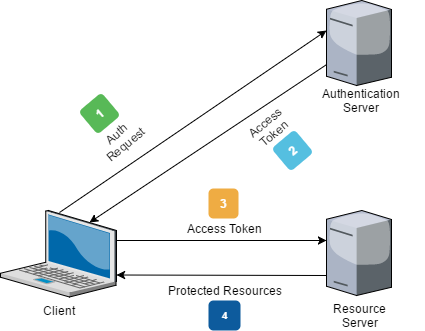
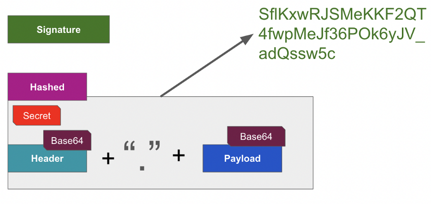

|               |                                     |                                        |
| ------------- | ----------------------------------- | -------------------------------------- |
| **Modul 321** | **Verteilte Systeme programmieren** |  |

- [1. REST API Authentication](#1-rest-api-authentication)
  - [1.1. Authentifizierung](#11-authentifizierung)
  - [1.2. Hacker Angriff](#12-hacker-angriff)
  - [1.3. Token Based Authentication](#13-token-based-authentication)
- [2. Role-based Access Control (RBAC)](#2-role-based-access-control-rbac)
  - [2.1. Beispiel Controller-Methoden mit RBAC](#21-beispiel-controller-methoden-mit-rbac)
- [3. Random String Generator](#3-random-string-generator)
- [4. Aufgaben](#4-aufgaben)
  - [4.1. JWT Authentifikation (TODO:)](#41-jwt-authentifikation-todo)
  - [4.2. JWT AuthService implementieren](#42-jwt-authservice-implementieren)
  - [4.3. JWT AuthService in Microservices implementieren (Class Library)](#43-jwt-authservice-in-microservices-implementieren-class-library)

---

# 1. REST API Authentication

## 1.1. Authentifizierung

Die **Authentifizierung** in einer REST Web API-Anwendung ist entscheidend, um sicherzustellen, dass **nur autorisierte Benutzer** oder Clients auf die API zugreifen können.
In einer RESTful Web API gibt es verschiedene gängige Methoden zur **Authentifizierung**, die jeweils unterschiedliche Anwendungsfälle und Sicherheitsanforderungen abdecken

## 1.2. Hacker Angriff

APIs sind heute das Frontend aller modernen Softwareanwendungen. Von der Essensbestellung bis zum Teilen von Fotos auf Instagram, vom Online-Einkauf bis zur Geldüberweisung - sie sind überall im Einsatz.

Eines der Hauptanliegen eines jeden API-Anbieters ist die Sicherung der übertragenen Daten. Die Idee ist, dass die Daten geheim sein sollten, dass sie unverändert bleiben sollten, während sie in Bewegung sind.


Das Bild zeigt ein typischer Anwendungsablauf in einem Unternehmen. Die Anwendung stellt über mehrere Angriffspunkte wie Gateway und API-Server eine Verbindung zu den Daten her. Ein Angriff kann an fast jedem dieser Punkte erfolgen.

- Der Angreifer kann die Anwendung angreifen und die Daten manipulieren oder die Identität stehlen.
- Der Angreifer kann sich die Schwachstellen des Gateways ansehen und dann tatsächlich eine Verbindung zu den Backend-Systemen herstellen.
- Der Angreifer kann auch die Firewall überwinden und direkt auf den API-Server oder die Datenbanken zugreifen.
- Als API-Entwickler müssen Sie all diese Angriffsmöglichkeiten bei der Entwicklung Ihrer APIs berücksichtigen. Die beste Lösung zum Schutz Ihrer API wäre, den Angreifer daran zu hindern, Ihren API-Verwaltungsserver oder die API selbst zu erreichen.

## 1.3. Token Based Authentication

Die JWT-Authentifizierung (JSON Web Token) wird in Microservice-Architekturen oft verwendet, um eine sichere, skalierbare und effiziente Methode der Authentifizierung und Autorisierung zu bieten. Der Einsatz von JWT in Verbindung mit einem **API-Gateway** ist eine gängige Praxis, um die Kommunikation zwischen verschiedenen Microservices und ihren Clients sicher zu gestalten.

`Authorization: Bearer <JWT-Token>`

Ein Token kann man sich als verschlüsselte Zeichenfolge vorstellen. Das bedeutet, dass einige relevante Benutzerinformationen einem Hashing oder einer Verschlüsselung mit einem privaten Schlüssel unterzogen werden und ein Token erzeugt wird.

Das Token wird vom **API-Gateway verifiziert** und dann zu den Microservices weitergegeben, **ohne dass jeder Microservice selbst die Authentifizierung vornehmen muss**. Dies reduziert die Komplexität und erhöht die Effizienz.



**Vorteile:**

- Das Token kann beliebig viele Informationen enthalten (z. B. Benutzerrolle, Ablaufdatum).
- Das Token ist unabhängig vom Serverzustand (stateless), was bedeutet, dass keine Sitzung auf dem Server gespeichert werden muss.
- Tokens haben ein Ablaufdatum und können nach Ablauf ungültig gemacht werden.
- Das Token kann zu jedem Zeitpunkt widerrufen werden.
- Geeignet für mobile Apps und Single-Page-Anwendungen (SPAs).

**Nachteile:**

- Wenn das Token gestohlen wird, kann es missbraucht werden, bis es abläuft oder widerrufen wird.
- Es muss sicher gespeichert und übertragen werden (z. B. im Authorization-Header oder im Cookie).

**Verwendung:**

Durch die Verwendung von JWT und einem **API-Gateway** lässt sich die Authentifizierung und Autorisierung in Microservice-Architekturen effizient und sicher gestalten, während gleichzeitig die Flexibilität und Skalierbarkeit erhalten bleiben.

Das **API-Gateway** fungiert als zentraler Punkt für die Eingabe von Anfragen. Der Hauptzweck des Gateways in dieser Architektur ist es, eingehende Anfragen von Clients zu entgegnen, das JWT zu extrahieren und zu validieren und dann die Anfrage an den entsprechenden Microservice weiterzuleiten.

[JWT (JSON Web Token)](https://jwt.io)
Es gibt verschiedene Möglichkeiten, ein Token zu erstellen.
Eine der beliebtesten Methoden zur Erstellung und Verwaltung von Token ist **JWT**, was für **JSON Web Tokens** steht.


JWT besteht also aus **drei Teilen**, die jeweils durch einen Punkt getrennt sind:

- **Header**
- **Nutzlast (Payload)**
- **Signatur**

Der Header enthält Metadaten wie:

- **Typ**, eine feste Zeichenfolge, die anzeigt, dass es sich um ein **JWT** handelt
- Der **Hash-Algorithmus**, es können mehrere Hash-Algorithmen verwendet werden, wie z. B.: SHA256, HMAC usw.


Die **Payload** ist der schwerste Teil des Tokens, er enthält die **claims**, die im Grunde nichts anderes als JSON, Attribute oder Elemente sind.


Es gibt drei Arten von Angaben, die in eines Payloads enthalten sind:

- Die erste ist die **registrierte claims**, die aus einer Reihe von Standard-attributen besteht.  Zum Beispiel: Aussteller, Gültigkeitsdauer, Zeitstempel usw.

- Dann gibt es die **öffentlichen Angaben**. Öffentliche Angaben sind die **Attributnamen wie Name, E-Mail, Telefonnummer und andere Attribute**, die den API-Konsumenten oder den Benutzer identifizieren. Jeder kann neue öffentliche Ansprüche vorschlagen.

- Der dritte Typ sind die **privaten Angaben**. Diese sind, wie der Name schon sagt, nicht standardisiert. Der Verbraucher und der Anbieter können entscheiden, welche Angaben in die Nutzdaten aufgenommen werden sollen.

**Signature:**

- Die Signatur wird erstellt, indem der base64-kodierte Header mit der base64-kodierten Payload verkettet wird und diese Zeichenfolge dann mit einem Hash-Verfahren mit einem Secret versehen wird.
- Das Secret kann eine beliebige Zeichenfolge sein, die der API-Anbieter sehr vertraulich behandeln muss. Wenn das Geheimnis an Unbefugte weitergegeben wird, können diese den API-Anbieter angreifen.



---

# 2. Role-based Access Control (RBAC)

- **Role-based Access Control (RBAC)** ist ein Sicherheitsmodell, das es ermöglicht, den Zugriff auf Ressourcen in einer Web-API-Anwendung basierend auf den Rollen der Benutzer zu steuern.
- **RBAC** ist eine weit **verbreitete Methode** zur Verwaltung von **Berechtigungen** und **Zugriffsrechten**, bei der Benutzer bestimmten Rollen zugeordnet werden, und diese Rollen definieren, welche Aktionen der Benutzer ausführen kann.
- Eine Rolle ist eine Sammlung von Berechtigungen oder Rechten, die einer Benutzergruppe zugewiesen werden. Zum Beispiel könnte es Rollen wie **"Admin", "User", "Manager", "Guest"** geben
- Jede Rolle hat spezifische Berechtigungen, die definieren, was ein Benutzer innerhalb der Anwendung tun darf (z.B. **lesen, schreiben, löschen**).
- Nach der **Authentifizierung** eines Benutzers wird geprüft, ob dieser Benutzer die Berechtigungen hat, bestimmte API-Ressourcen zu nutzen.

## 2.1. Beispiel Controller-Methoden mit RBAC

```c#
[Authorize(Roles = "Admin")]
[HttpPost]
public IActionResult CreateProduct(Product product)
{
    // Nur Admins dürfen Produkte erstellen
    // Logik zum Erstellen eines Produkts
    return Ok();
}

[Authorize(Roles = "Admin,User")]
[HttpGet]
public IActionResult GetProducts()
{
    // Admins und User können Produkte anzeigen
    var products = _productService.GetAllProducts();
    return Ok(products);
}

[Authorize(Roles = "Admin")]
[HttpPut("{id}")]
public IActionResult UpdateProduct(int id, Product product)
{
    // Nur Admins können Produkte aktualisieren
    var result = _productService.UpdateProduct(id, product);
    if (!result)
    {
        return NotFound();
    }
    return NoContent();
}

[Authorize(Roles = "Admin")]
[HttpDelete("{id}")]
public IActionResult DeleteProduct(int id)
{
    // Nur Admins dürfen Produkte löschen
    var result = _productService.DeleteProduct(id);
    if (!result)
    {
        return NotFound();
    }
    return NoContent();
}
```

# 3. Random String Generator

Auf der Webseite von [random.org](https://www.random.org/strings/) können Sie zufällige Textzeichenfolgen erzeugen.
Die Zufälligkeit wird durch atmosphärisches Rauschen erzeugt, was für viele Zwecke besser ist als die in Computerprogrammen verwendeten Pseudo-Zufallszahlen-Algorithmen.

.NET stellt für die Generierung von API-Keys die `RandomNumberGenerator` Klasse zur Verfügung.

Beispiel:

```c#
varkey = newbyte[32];
using(vargenerator = RandomNumberGenerator.Create())
    generator.GetBytes(key);
stringapiKey = Convert.ToBase64String(key);
```

---

# 4. Aufgaben

## 4.1. JWT Authentifikation (TODO:)

|                     |                                                                       |
| :------------------ | :-------------------------------------------------------------------- |
| **Lernziele**       | Sie können ein Web API Projekt erstellen.                             |
|                     | Sie können eine JWT (JSON Web Token) Authentifikation implementieren. |
|                     | Sie können die Web API Endpunkte mit Postman testen.                  |
| **Sozialform**      | Einzelarbeit                                                          |
| **Auftrag**         | siehe unten                                                           |
| **Hilfsmittel**     |                                                                       |
| **Zeitbedarf**      | 80min                                                                 |
| **Lösungselemente** | Lauffähiges Web API Projekt                                           |

Der Dozent stellt Ihnen ein vorbereitetes Web-API Projekt auf GibHub zum Download bereit.
In mehreren Projektdateien sind einige Code-Fragmente unvollständig und mit **TODO:** markiert.
In diesen Codezeilen muss der Programmcode vervollständigt werden, sodass am Schluss ein funktionierendes und lauffähiges Programm entsteht.

**Projekt:**

- <https://github.com/INFEFZ/Modul321-JWTAuth-Aufgabe>
- Login: username:INFEFZ, Passwort: ibz12345$

Vorgehen:

- Rufen und öffnen Sie das Projekt auf GitHub
- Suchen Sie über alle Projektdateien den **TODO:** Text
- Vervollständigen Sie alle **TODO:** Texte mit dem korrekten Programmcode
- Testen Sie die Anwendung mit Postman.
  - **AccountController**
    - Login mit Username u. Passwort um bei korrekter Anmeldung ein JWT zu erhalten
  - **TestController**
    - Endpoint First sollte immer auch ohne Anmeldung bzw. JWT aufgerufen werden können.
    - Tipp: `[AllowAnonymous]`
  - Endpoint Second darf nur mit vorgängiger Anmeldung (JWT) aufgerufen werden.
    - Tipp: `[Authorize]`

**Bemerkung:**
Beachten Sie, dass in der Main() Methode `UseAuthentication()` aufgerufen werden muss.

```c#
// ...
// ...
app.UseHttpsRedirection();

// Auth
app.UseAuthentication();
app.UseAuthorization();

app.MapControllers();

app.Run();
```

## 4.2. JWT AuthService implementieren

| **Vorgabe**         | **Beschreibung**                                                                                                                           |
| :------------------ | :----------------------------------------------------------------------------------------------------------------------------------------- |
| **Lernziele**       | Sie können ein Web API Projekt erstellen.                                                                                                  |
|                     | Sie können eine JWT (JSON Web Token) Authentifikation implementieren.                                                                      |
|                     | Sie können die Web API Endpunkte mit Postman testen.                                                                                       |
| **Sozialform**      | Einzelarbeit                                                                                                                               |
| **Auftrag**         | siehe unten                                                                                                                                |
| **Hilfsmittel**     | [JWT-Token](https://learn.microsoft.com/en-us/aspnet/core/security/authentication/configure-jwt-bearer-authentication?view=aspnetcore-9.0) |
| **Zeitbedarf**      | 120min                                                                                                                                     |
| **Lösungselemente** | Lauffähige Anwendung auf dem Laptop                                                                                                        |

**Aufgabe 1:**

Erweitere die **e-commerce** Anwendung (siehe Aufgaben in Kapitel Microservices) mit einem `AuthService`,
der für die Authentifikation der Benutzer zuständig ist.
Erstelle hierzu in der **e-commerce** Solution ein zusätzliches WebAPI-Projekt (Name=**AuthService**) und implementiere für einen
geschützten Zugang eine Login WebAPI-Request mit Benutzername und Passwort.

Ändere im `ProductService` einige Methoden so, dass diese geschützt (`[Authorize]`) sind und nur noch mit einem korrekten JWT-Token aufgerufen werden können.

- **Solution: ecommerce**
- 

**Aufgabe 2:**

Erweitere die Aufgabe 1, indem die geschützten Methoden zusätzlich mit einem **Role-based Access Control (RBAC)** gesichert werden.

---

## 4.3. JWT AuthService in Microservices implementieren (Class Library)

| **Vorgabe**         | **Beschreibung**                                                                                      |
| :------------------ | :---------------------------------------------------------------------------------------------------- |
| **Lernziele**       | Kann ein Class Library-Projekt erstellen                                                              |
|                     | Kann aus einem Hauptprojekt ein Class Library-Projekt                                                 |
|                     | Kennt die Möglichkeiten zur Wiederverwendbarkeit von Programmcode in Klassen-Libraries                |
| **Sozialform**      | Einzelarbeit                                                                                          |
| **Auftrag**         | siehe unten                                                                                           |
| **Hilfsmittel**     | [Library Projekt](https://learn.microsoft.com/en-us/dotnet/core/tutorials/library-with-visual-studio) |
| **Zeitbedarf**      | 60min                                                                                                 |
| **Lösungselemente** | Lauffähige Anwendung auf dem Laptop                                                                   |

Die Registrierung der Authentifikationseinstellungen (JwtBearer) beim Programmstart ist in allen Microservices identisch.
Um **Code-Redundanz** zu vermeiden und die Wiederverwendbarkeit zu erhöhen, sollte dies in ein **Klassenbibliotheks-Projekt** ausgelagert werden.

Überlege, wie der folgende Programmcode in ein **Klassenbibliotheks-Projekt** eingefügt und von den Hauptprogrammen (Microservices) aufgerufen werden kann.

```c#
builder.Services.AddAuthentication(JwtBearerDefaults.AuthenticationScheme)
  .AddJwtBearer(options =>
  {
    options.TokenValidationParameters = new TokenValidationParameters
    {
      ValidateIssuerSigningKey = true,
      IssuerSigningKey = new SymmetricSecurityKey(Encoding.UTF8.GetBytes(builder.Configuration["Jwt:Key"])),
      ValidAudience = builder.Configuration["Jwt:Audience"],
      ValidIssuer = builder.Configuration["Jwt:Issuer"],
      ValidateIssuer = false,
      ValidateAudience = false
    };
  });
```
