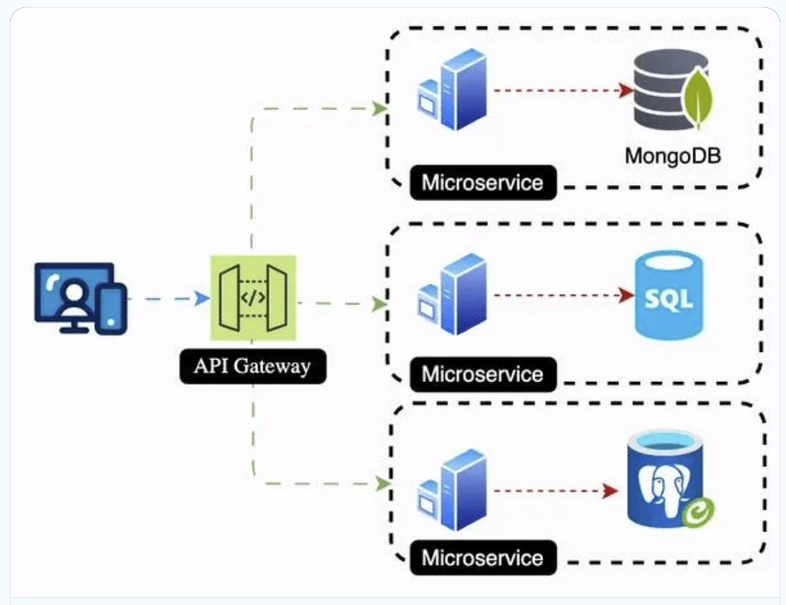
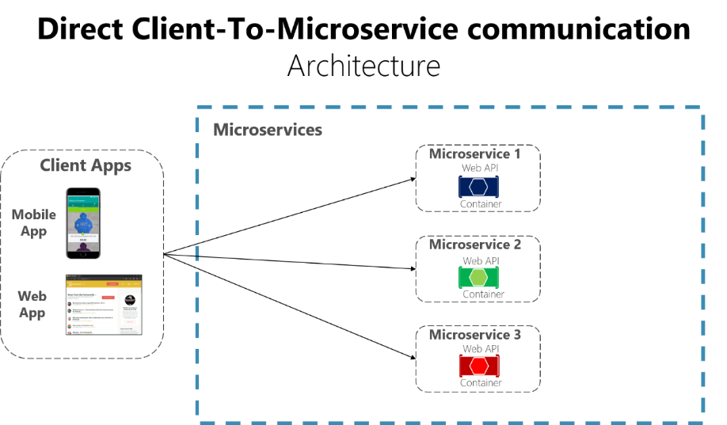
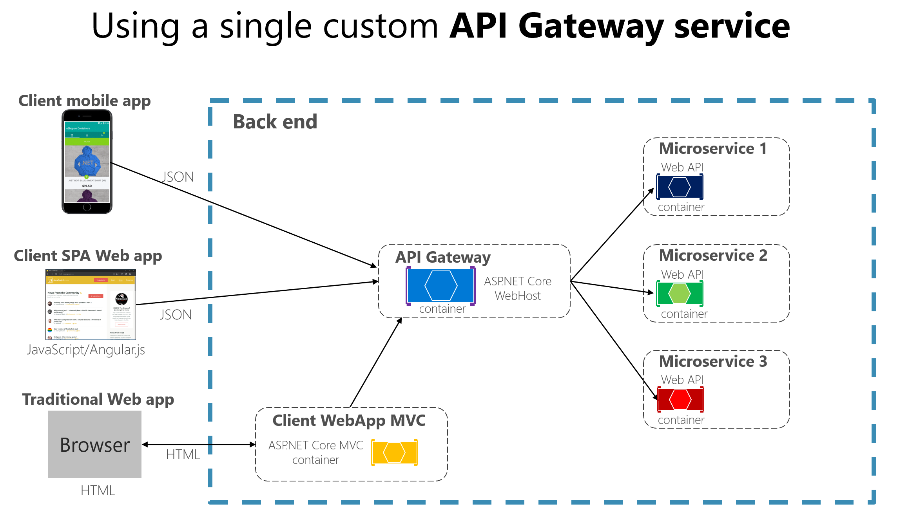
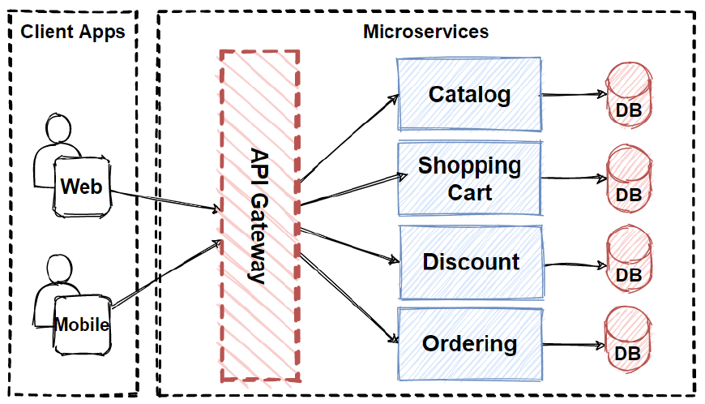
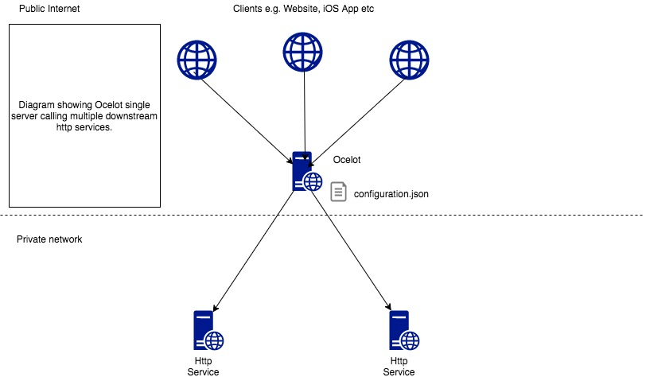
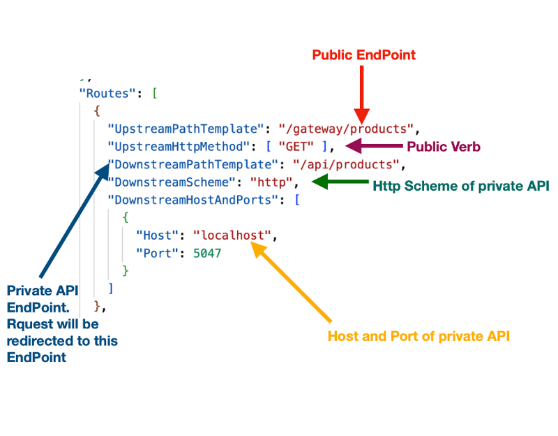
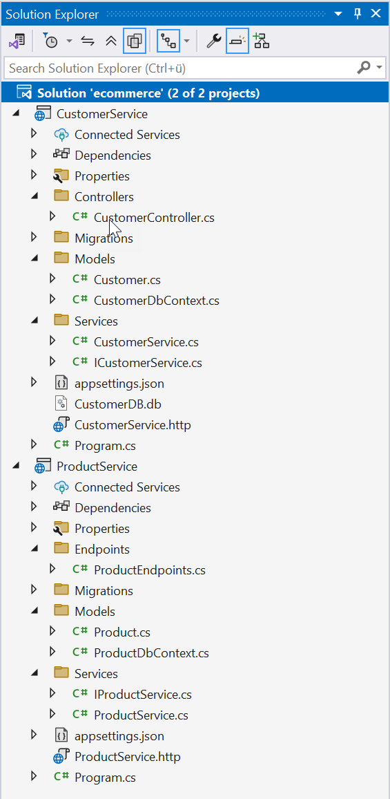

|               |                                     |                                        |
| ------------- | ----------------------------------- | -------------------------------------- |
| **Modul 321** | **Verteilte Systeme programmieren** |  |

- [1. API-Gateway in verteilten Systemen](#1-api-gateway-in-verteilten-systemen)
  - [1.1. Einführung](#11-einführung)
    - [1.1.1. Mit und ohne Gateway](#111-mit-und-ohne-gateway)
  - [1.2. Was ist ein API-Gateway?](#12-was-ist-ein-api-gateway)
  - [1.3. Ocelot API Gateway](#13-ocelot-api-gateway)
    - [1.3.1. Vorteile von Ocelot](#131-vorteile-von-ocelot)
    - [1.3.2. Architektur](#132-architektur)
    - [1.3.3. Installation .NET](#133-installation-net)
      - [Konfigurationsdateien hinzufügen](#konfigurationsdateien-hinzufügen)
      - [Konfigurationseinstellungen](#konfigurationseinstellungen)
    - [1.3.4. .NET Startup-Konfiguration](#134-net-startup-konfiguration)
- [2. Aufgaben](#2-aufgaben)
  - [2.1. Gateway implementieren](#21-gateway-implementieren)
  - [2.2. Rate Limiting implementieren](#22-rate-limiting-implementieren)

</br>

# 1. API-Gateway in verteilten Systemen

## 1.1. Einführung

- Microservices-Architekturen bestehen aus einer **Vielzahl von unabhängigen Diensten**, die gemeinsam eine Anwendung bilden.
- Diese Architektur bietet Vorteile wie **Skalierbarkeit**, **Flexibilität** und **Robustheit**.
- Allerdings führt sie auch zu Herausforderungen, insbesondere bei der **Verwaltung der Kommunikation** zwischen den einzelnen Microservices und externen Clients.
- Ein **API-Gateway** ist eine zentrale Komponente, die dazu dient, diese Kommunikation zu steuern und zu optimieren.



### 1.1.1. Mit und ohne Gateway

**Ohne Gateway:** Direkt Kommunikation mit Microservice



**Mit Gateway**: Zentrale Kommunikationsstelle für alle Anwendungen



## 1.2. Was ist ein API-Gateway?

Ein API-Gateway ist eine **zentrale Schnittstelle**, die als Vermittler zwischen Clients und Microservices agiert.
Es nimmt Anfragen von **Clients** entgegen, leitet sie an die entsprechenden **Microservices** weiter und gibt die Antworten an die Clients zurück.
Dabei kann es **zusätzliche Aufgaben** übernehmen, wie **Authentifizierung, Rate Limiting, Logging und Caching**.

API-Gateways sind ein essenzieller Bestandteil moderner Microservices-Architekturen.
Sie erleichtern die Verwaltung von Schnittstellen, erhöhen die Sicherheit und verbessern die Skalierbarkeit.



## 1.3. Ocelot API Gateway

- **Ocelot** ist ein Open-Source-API-**Gateway**, das speziell für .NET-Anwendungen entwickelt wurde.
- Es bietet **Routing**-, **Authentifizierungs**-, **Autorisierungs**-, **Lastenausgleichs**-, **Logging**- und **Caching**-Funktionen für **Microservices**-Architekturen.
- **Ocelot** wird häufig in Szenarien verwendet, in denen mehrere Backend-Services von einem zentralen Punkt aus verwaltet werden sollen.



### 1.3.1. Vorteile von Ocelot

- **Routing**: Ocelot ermöglicht das Weiterleiten von Anfragen an spezifische Backend-Services basierend auf definierten Regeln.
- **Load Balancing**: Es verteilt Anfragen gleichmäßig auf mehrere Instanzen eines Microservices.
- **Security**: Unterstützt verschiedene Authentifizierungs- und Autorisierungsmechanismen (z. B. JWT, OAuth2).
- **Rate Limiting**: Begrenzung der Anzahl von Anfragen, die ein Client senden darf.
- **Transformation**: Manipulation von Anfragen und Antworten, z. B. Änderung von Headern oder Umwandlung von Daten.
- **Caching**: Ermöglicht das Zwischenspeichern von Antworten, um die Performance zu verbessern.
- **Integration**: Einfach zu integrieren mit ASP.NET Core.

### 1.3.2. Architektur

Ocelot sitzt zwischen den Clients und den Backend-Microservices:

Client  **->**  Ocelot API Gateway  **->**  Microservice A
                                 **->**  Microservice B
                                 **->**  Microservice C

### 1.3.3. Installation .NET

```console
dotnet add package Ocelot
dotnet add package Microsoft.Extensions.Hosting
```

#### Konfigurationsdateien hinzufügen

Erstelle eine **`ocelot.json`**-Datei im Projektstamm. Diese Datei definiert die Routen und Regeln für das **Gateway**.

Beispiel für **`ocelot.json`**:

```json
{
  "Routes": [
    {
      "DownstreamPathTemplate": "/api/users",
      "DownstreamScheme": "http",
      "DownstreamHostAndPorts": [
        {
          "Host": "localhost",
          "Port": 5001
        }
      ],
      "UpstreamPathTemplate": "/users",
      "UpstreamHttpMethod": [ "Get" ]
    },
    {
      "DownstreamPathTemplate": "/api/products",
      "DownstreamScheme": "http",
      "DownstreamHostAndPorts": [
        {
          "Host": "localhost",
          "Port": 5002
        }
      ],
      "UpstreamPathTemplate": "/products",
      "UpstreamHttpMethod": [ "Get" ]
    }
  ],
  "GlobalConfiguration": {
    "BaseUrl": "http://localhost:5000"
  }
}
```

---

#### Konfigurationseinstellungen



### 1.3.4. .NET Startup-Konfiguration

```c#
using Microsoft.AspNetCore.Builder;
using Microsoft.Extensions.DependencyInjection;
using Microsoft.Extensions.Hosting;
using Ocelot.DependencyInjection;
using Ocelot.Middleware;

var builder = WebApplication.CreateBuilder(args);

// Ocelot-Services hinzufügen
builder.Services.AddOcelot();

var app = builder.Build();

// Ocelot-Middleware verwenden
await app.UseOcelot();

app.Run();
```

</br>

# 2. Aufgaben

## 2.1. Gateway implementieren

| **Vorgabe**         | **Beschreibung**                                                           |
| :------------------ | :------------------------------------------------------------------------- |
| **Lernziele**       | Kann in .NET ein API Gateway konfigurieren und implementieren              |
|                     | Kann up- und downstream konfigurieren                                      |
|                     | Kann mehrere Microservices mit einem Gateway koppeln                       |
| **Sozialform**      | Einzelarbeit                                                               |
| **Auftrag**         | siehe unten                                                                |
| **Hilfsmittel**     | [Ocelot Dokumentation](https://ocelot.readthedocs.io/en/latest/index.html) |
| **Zeitbedarf**      | 120min                                                                     |
| **Lösungselemente** | Lauffähige Anwendung auf dem Laptop                                        |

Erweitere die **e-commerce** Anwendung (siehe Aufgaben in Kapitel Microservices) mit dem Gateway (Ocelot),
sodass beide Service über eine Url im Zugriff stehen.
Erstelle hierzu ein zusätzliches WebAPI-Projekt (Name=**ECommerce**), installiere das Ocelot NuGet Paket und erstelle eine **`ocelot.json`** Datei.

- **Solution: ecommerce**
- 

---

## 2.2. Rate Limiting implementieren

| **Vorgabe**         | **Beschreibung**                                                           |
| :------------------ | :------------------------------------------------------------------------- |
| **Lernziele**       | Kennt die Möglichkeiten von Rate Limiting in einem Gateway Projekt         |
|                     | Kann ein Rate Limiting in ein Gateway-Projekt implementieren und testen    |
| **Sozialform**      | Einzelarbeit                                                               |
| **Auftrag**         | siehe unten                                                                |
| **Hilfsmittel**     | [Ocelot Dokumentation](https://ocelot.readthedocs.io/en/latest/index.html) |
| **Zeitbedarf**      | 60min                                                                      |
| **Lösungselemente** | Lauffähige Anwendung auf dem Laptop                                        |

**Ocelot** bietet eine **Rate Limiting** für Upstream-Anfragen, um zu verhindern, dass Downstream-Dienste **überlastet** werden.
Erweitere die obige Aufgabe mit einem Rate Limiting Konfiguration und stelle die korrekte Funktionsweise sicher.

[Ocelot Rate Limiting](https://ocelot.readthedocs.io/en/latest/features/ratelimiting.html#)
