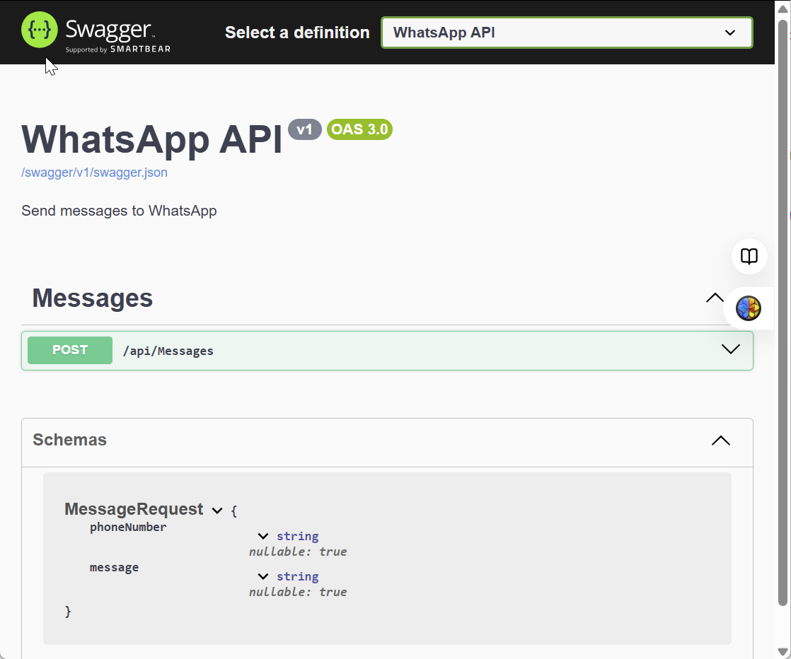

|               |                                     |                                        |
| ------------- | ----------------------------------- | -------------------------------------- |
| **Modul 321** | **Verteilte Systeme programmieren** |  |

- [1. WhatsApp API mit ASP.NET WebAPI](#1-whatsapp-api-mit-aspnet-webapi)
  - [1.1. Einführung](#11-einführung)
  - [1.2. Twilio Angebot](#12-twilio-angebot)
  - [1.3. Twilio für WhatsApp](#13-twilio-für-whatsapp)
- [2. Aufgaben](#2-aufgaben)
  - [2.1. Twilio Registrierung](#21-twilio-registrierung)
  - [2.2. WhatsApp - Konsole](#22-whatsapp---konsole)
  - [2.3. WhatsApp - WebAPI](#23-whatsapp---webapi)

---

 

# 1. WhatsApp API mit ASP.NET WebAPI

## 1.1. Einführung

**[Twilio](https://www.twilio.com/en-us)** ist eine sehr bekannte Cloud-Kommunikationsplattform, die Entwicklern hilft, Kommunikationskanäle wie **SMS, Anrufe, Videoanrufe und Messaging** in ihre Anwendungen zu integrieren.
**Twilio** stellt **APIs** zur Verfügung, die es ermöglichen, mit verschiedenen Kanälen zu kommunizieren, ohne dass Entwickler die **komplexen Infrastrukturen** hinter diesen Kanälen selbst aufbauen müssen.

## 1.2. Twilio Angebot

- SMS und MMS
- WhatsApp
- Sprachanrufe (Voice)
- Video
- Chat (Twilio Chat API)
- usw.

## 1.3. Twilio für WhatsApp

**Twilio** ermöglicht es Unternehmen, **WhatsApp** als Kanal für die Kommunikation mit ihren Kunden zu nutzen, und das über die **Twilio API** für WhatsApp.

- **Twilio** bietet eine umfassende Lösung für die Integration von WhatsApp in die Unternehmenskommunikation. Mit der **Twilio-WhatsApp API** können Unternehmen eine Vielzahl von Kommunikationslösungen für den Kundenservice, Benachrichtigungen, Marketing und Automatisierung umsetzen.
- Die einfache Integration, Skalierbarkeit, Unterstützung für Multimedia und interaktive Nachrichten sowie die Echtzeit-Überwachung machen **Twilio** zu einer bevorzugten Wahl für Unternehmen, die WhatsApp nutzen möchten, um ihre Kunden effizient zu erreichen.

 

# 2. Aufgaben

## 2.1. Twilio Registrierung

| **Vorgabe**         | **Beschreibung**                                           |
| :------------------ | :--------------------------------------------------------- |
| **Lernziele**       | Kennt die Möglichkeiten der Twilio Kommunikationsplattform |
|                     | Kann einen Sandbox Registierung durchführen                |
|                     | Kann das WhatsApp API korrekt implementieren               |
| **Sozialform**      | Einzelarbeit                                               |
| **Auftrag**         | siehe unten                                                |
| **Hilfsmittel**     | [Twilio](https://www.twilio.com/en-us)                     |
| **Zeitbedarf**      | 30 min                                                     |
| **Lösungselemente** | Twilio Account                                             |

- Befolge die Anweisungen auf <https://www.twilio.com/console/sms/whatsapp/sandbox>, um Deine Sandbox zu aktivieren.
- Suchen deine **Account Sid** und **Token** unter **twilio.com/console** und legen sie in der **`appsettings.json`** fest.
- Führen Sie das Beispiel aus Öffnen Sie die Sende-Seite und senden Sie eine WhatsApp.
- Lese das [C#/.NET Quickstart Tutorial - Programmable Messaging for WhatsApp and C#/.NET Quickstart](https://www.twilio.com/docs/whatsapp/quickstart/csharp)

---

## 2.2. WhatsApp - Konsole

| **Vorgabe**         | **Beschreibung**                                                             |
| :------------------ | :--------------------------------------------------------------------------- |
| **Lernziele**       | Kann das WhatsApp API von Twilio implementieren                              |
|                     | Kann über das API WhatsApp Nachrichten versenden                             |
|                     | Kann die Zugangsdaten konfigurieren                                          |
| **Sozialform**      | Einzelarbeit                                                                 |
| **Auftrag**         | siehe unten                                                                  |
| **Hilfsmittel**     | [C#/.NET Quickstart](https://www.twilio.com/docs/whatsapp/quickstart/csharp) |
| **Zeitbedarf**      | 60min                                                                        |
| **Lösungselemente** | Lauffähige und funktionstaugliche Anwendung                                  |

Erstelle eine Konsole-App die eine Nachricht von der Console oder von der Kommandozeile einliest und über das Twilio-API an die konfigurierte Mobile-Nr. sendet.
Die Konfigurationsdaten (Sid, Token, Mobile-Nr. usw.) sind in der `appsetting.json` einzutragen und vom Programm auszulesen.

---

## 2.3. WhatsApp - WebAPI

| **Vorgabe**         | **Beschreibung**                                                             |
| :------------------ | :--------------------------------------------------------------------------- |
| **Lernziele**       | Kann das WhatsApp API von Twilio implementieren                              |
|                     | Kann über das API WhatsApp Nachrichten versenden                             |
|                     | Kann das WhatsApp-API in eine WebAPI Projekt integrieren                     |
|                     | Kann Daten in einer MongoDB speichern                                        |
| **Sozialform**      | Einzelarbeit                                                                 |
| **Auftrag**         | siehe unten                                                                  |
| **Hilfsmittel**     | [C#/.NET Quickstart](https://www.twilio.com/docs/whatsapp/quickstart/csharp) |
| **Zeitbedarf**      | 60min                                                                        |
| **Lösungselemente** | Lauffähige und funktionstaugliche Anwendung                                  |

**Aufgabe 1:**

Erstelle eine **ASP.NET WebAPI** Anwendung die ein Web-Endpoint (Request) für den Nachrichtenversand zur Verfügung stellt.
Die Konfigurationsdaten (Sid, Token, Mobile-Nr. usw.) sind in der `appsetting.json` einzutragen und vom Programm auszulesen.

Die Web API muss folgende Methode zur Verfügung stellen:

**Aufgabe 2:**

Erweitere das Web-API Projekt, sodass die Nachrichten vor dem Versand in einer **MongoDB** Datenbank (MessageDB) gespeichert werden.
