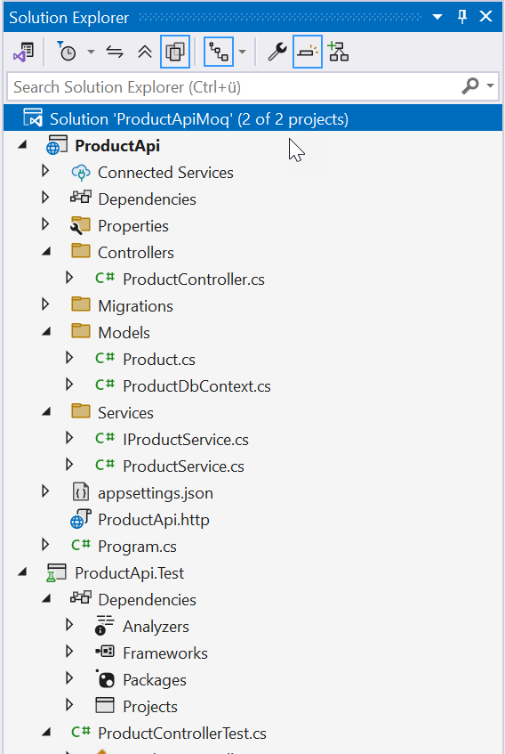
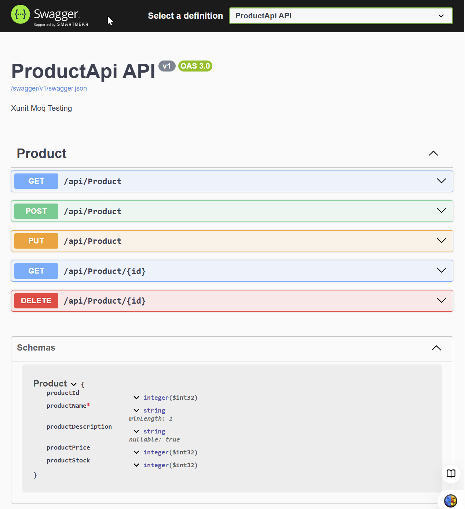
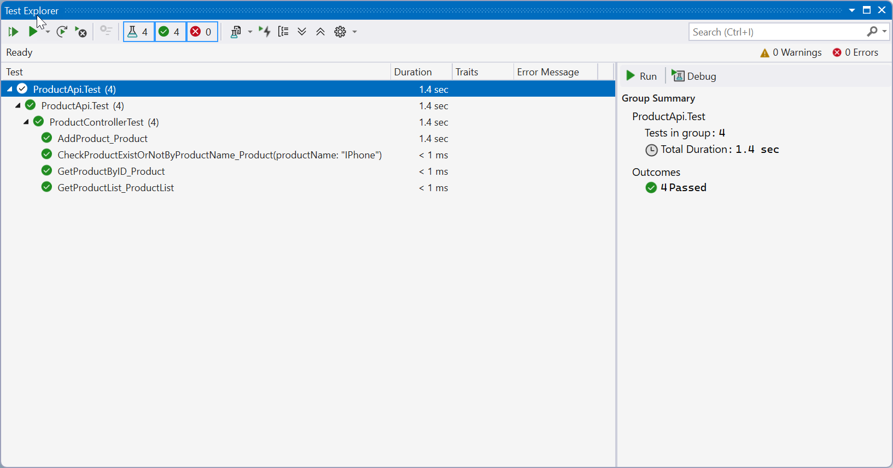

|               |                                     |                                        |
| ------------- | ----------------------------------- | -------------------------------------- |
| **Modul 321** | **Verteilte Systeme programmieren** |  |

- [1. Unit-Test](#1-unit-test)
  - [1.1. Was ist ein Unit Test?](#11-was-ist-ein-unit-test)
  - [1.2. Struktur eines Unit-Tests](#12-struktur-eines-unit-tests)
  - [1.3. Moq](#13-moq)
  - [1.4. Testen von ASP.NET Core-Controllern](#14-testen-von-aspnet-core-controllern)
    - [1.4.1. Unit Test eines Controllers](#141-unit-test-eines-controllers)
- [2. Aufgaben](#2-aufgaben)
  - [2.1. Median Calculator testen](#21-median-calculator-testen)
  - [2.2. WebAPI Controller Testing (ProductApiMoq)](#22-webapi-controller-testing-productapimoq)

---

</br>

# 1. Unit-Test

## 1.1. Was ist ein Unit Test?

Ein **Unit Test** ist ein automatisierter Test, der eine kleine, isolierte Funktionseinheit der Software überprüft. Ein Unit-Test soll sicherstellen, dass eine **bestimmte Methode oder Funktion so funktioniert**, wie sie sollte, ohne dass andere Teile des Systems betroffen sind. **Unit-Tests** sind besonders wichtig, um die **Testbarkeit** des Codes zu gewährleisten und Regressionen zu vermeiden.

 > Unit Tests sind eine wichtige Massnahme, um die **Qualität**, **Stabilität** und **Wartbarkeit** von Software sicherzustellen, indem sie eine zuverlässige Überprüfung der einzelnen Komponenten bieten.

## 1.2. Struktur eines Unit-Tests

In einem typischen Unit-Test-Projekt gibt es folgende Struktur:

**Arrange**: Vorbereiten der Testdaten und Abhängigkeiten.
**Act**: Ausführen der zu testenden Methode.
**Assert**: Überprüfen, ob das Ergebnis den Erwartungen entspricht.

```c#
public class MyServiceTests
{
    [Fact]
    public void AddNumbers_ReturnsCorrectSum()
    {
        // Arrange
        var service = new MyService();
        
        // Act
        var result = service.AddNumbers(2, 3);
        
        // Assert
        result.Should().Be(5);
    }
}
```

## 1.3. Moq

**Moq** ist eine weit verbreitete **Bibliothek**, die verwendet wird, um Objekte zu mocken, die im Test isoliert werden sollen.

Installation mit NuGet-Konsole: `dotnet add package Moq`

```c#
public class MyServiceTests
{
    [Fact]
    public void GetUser_ShouldReturnCorrectUser()
    {
        // Arrange
        var mockRepo = new Mock<IUserRepository>();
        mockRepo.Setup(repo => repo.GetUserById(1)).Returns(new User { Id = 1, Name = "John Doe" });
        
        var service = new UserService(mockRepo.Object);
        
        // Act
        var result = service.GetUser(1);
        
        // Assert
        result.Name.Should().Be("John Doe");
    }
}
```

## 1.4. Testen von ASP.NET Core-Controllern

Wenn ein **Web-Controller** in einem ASP.NET Core-Projekt getestet wird, können Integrationstests oder **Unit-Tests** durchführt werden.

### 1.4.1. Unit Test eines Controllers

Wenn der Controller logische Abhängigkeiten hat (z. B. Service-Schicht), sollten diese mit **Mocks** ersetzt werden.

```c#
using Moq;
using MyApp.Controllers;
using MyApp.Models;
using Xunit;
using Microsoft.AspNetCore.Mvc;
using System.Collections.Generic;
using System.Linq;

namespace MyApp.Tests
{
    public class ProductControllerTests
    {
        private readonly Mock<IProductService> _mockProductService;
        private readonly ProductController _controller;

        public ProductControllerTests()
        {
            // Moq initialisieren
            _mockProductService = new Mock<IProductService>();

            // Controller instanziieren und Moq übergeben
            _controller = new ProductController(_mockProductService.Object);
        }

        [Fact]
        public void GetProducts_ReturnsOkResult_WithListOfProducts()
        {
            // Arrange: Ein Dummy-Produkt erzeugen und das Mock so konfigurieren, dass es eine Produktliste zurückgibt.
            var mockProducts = new List<Product>
            {
                new Product { Id = 1, Name = "Product 1", Price = 10.99m },
                new Product { Id = 2, Name = "Product 2", Price = 20.99m }
            };

            _mockProductService.Setup(service => service.GetAllProducts()).Returns(mockProducts);

            // Act: Auf die GetProducts-Methode zugreifen
            var result = _controller.GetProducts();

            // Assert: Überprüfen, ob das Ergebnis ein OKResult mit der richtigen Produktliste ist
            var actionResult = Assert.IsType<OkObjectResult>(result.Result);
            var returnValue = Assert.IsAssignableFrom<IEnumerable<Product>>(actionResult.Value);
            Assert.Equal(mockProducts.Count, returnValue.Count());
        }

        [Fact]
        public void GetProduct_ReturnsNotFound_WhenProductDoesNotExist()
        {
            // Arrange: Setzen, dass keine Produkte gefunden werden
            _mockProductService.Setup(service => service.GetProductById(It.IsAny<int>())).Returns((Product)null);

            // Act: Auf die GetProduct-Methode zugreifen
            var result = _controller.GetProduct(1);

            // Assert: Überprüfen, dass das Ergebnis ein NotFoundResult ist
            Assert.IsType<NotFoundResult>(result.Result);
        }

        [Fact]
        public void GetProduct_ReturnsOkResult_WithProduct()
        {
            // Arrange: Ein Dummy-Produkt erzeugen
            var mockProduct = new Product { Id = 1, Name = "Product 1", Price = 10.99m };
            _mockProductService.Setup(service => service.GetProductById(1)).Returns(mockProduct);

            // Act: Auf die GetProduct-Methode zugreifen
            var result = _controller.GetProduct(1);

            // Assert: Überprüfen, ob das Ergebnis ein OKResult mit dem richtigen Produkt ist
            var actionResult = Assert.IsType<OkObjectResult>(result.Result);
            var returnValue = Assert.IsType<Product>(actionResult.Value);
            Assert.Equal(mockProduct.Id, returnValue.Id);
            Assert.Equal(mockProduct.Name, returnValue.Name);
        }
    }
}
```

**Erläuterung zum Code:**

- Wir verwenden Moq für das Mocken des **`IProductService`** und legen fest, welche Werte zurückgegeben werden sollen, wenn Methoden wie **`GetAllProducts()`** oder **`GetProductById()`** aufgerufen werden.
- **`GetProducts_ReturnsOkResult_WithListOfProducts`**: Testet, ob der Controller eine **Liste von Produkten** erfolgreich zurückgibt.
- **`GetProduct_ReturnsNotFound_WhenProductDoesNotExist`**: Testet den Fall, wenn **kein Produkt** gefunden wird und der Controller `NotFound()` zurückgibt.
- **`GetProduct_ReturnsOkResult_WithProduct`**: Testet den Fall, wenn **ein Produkt** gefunden wird und der Controller es zurückgibt.

---

</br>

# 2. Aufgaben

## 2.1. Median Calculator testen

| **Vorgabe**         | **Beschreibung**                                                                                |
| :------------------ | :---------------------------------------------------------------------------------------------- |
| **Lernziele**       | Kann ein Unit-Testprojekt erstellen                                                             |
|                     | Kann die korrekte Funktion und Berechnung einer Methode mit Testmethoden prüfen                 |
|                     | Kann automatische Tests durchführen                                                             |
| **Sozialform**      | Einzelarbeit                                                                                    |
| **Auftrag**         | siehe unten                                                                                     |
| **Hilfsmittel**     | [ms-learn](https://learn.microsoft.com/en-us/dotnet/core/testing/unit-testing-with-dotnet-test) |
| **Zeitbedarf**      | 80min                                                                                           |
| **Lösungselemente** | Korrektes Testprojekt und Testergebnisse                                                        |

**Aufgabe 1:**
Lese das [Getting Started with xUnit.net Tutorial](https://xunit.net/docs/getting-started/v2/netfx/visual-studio) komplett durch

**Aufgabe 2:**
Erstelle eine Konsolen-Projekt (Name=**Calculator**) mit nachfolgender Klasse.

```c#
public class MedianCalculator
{
    public double CalculateMedian(double[] numbers)
    {
        var numbersCloned = (double[])numbers.Clone();
        Array.Sort(numbersCloned);
        var size = numbersCloned.Length;
        var mid = size / 2;

        if (size % 2 != 0)
            return numbersCloned[mid];

        var midValue1 = numbersCloned[mid];
        var midValue2 = numbersCloned[mid - 1];
        return (midValue1 + midValue2) / 2;
    }
}
```

Erstelle nun in derselben Solution ein **xUnit** Testprojekt (Name=Calculator.Test) und
prüfe in mehreren Testmethoden (Fact) mit unterschiedlichen Werten die korrekte Berechnung.

```c#
[Fact]
public void Calculates_Median_With_3_Values()
{
    //Arrange
    var sut = new MedianCalculator();
    // ...

    //Act
    // ...

    //Assert
    //...
}

// ...
```

## 2.2. WebAPI Controller Testing (ProductApiMoq)

| **Vorgabe**         | **Beschreibung**                                                                                |
| :------------------ | :---------------------------------------------------------------------------------------------- |
| **Lernziele**       | Kann ein Unit-Testprojekt erstellen                                                             |
|                     | Kann die korrekte Funktion und Berechnung einer Methode mit Testmethoden prüfen                 |
|                     | Kann automatische Tests durchführen                                                             |
| **Sozialform**      | Einzelarbeit                                                                                    |
| **Auftrag**         | siehe unten                                                                                     |
| **Hilfsmittel**     | [ms-learn](https://learn.microsoft.com/en-us/dotnet/core/testing/unit-testing-with-dotnet-test) |
| **Zeitbedarf**      | 80min                                                                                           |
| **Lösungselemente** | Korrektes Testprojekt und Testergebnisse                                                        |

**Aufgabe 1:**

Der Dozent stellt Ihnen ein vorbereitetes Web-API Projekt auf GibHub zum Download bereit.
Die Solution besteht aus einen WebAPI und einem xUnit Testprojekt.
Rufe das Projekt ab, konfiguriere und teste das WebAPI-Projekt auf deinem Rechner.





**Projekt:**

- <https://github.com/INFEFZ/Modul321-ProductApiMoq-Aufgabe>
- Login: username:INFEFZ, Passwort: ibz12345$

**Aufgabe 2:**

Im Testprojekt sind die vorbereiteten Testmethoden vollständig auszuprogrammieren.
Führe alle Testmethoden aus und prüfe das Testresultat im Test-Explorer.


